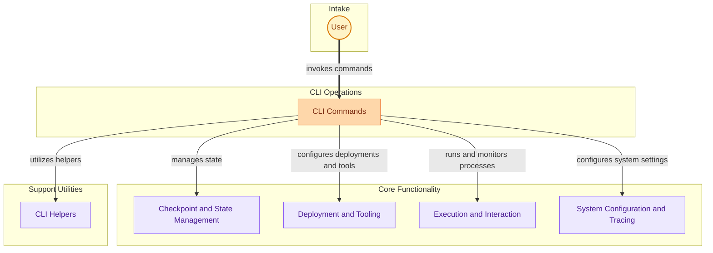

# CLI Commands
This module provides a comprehensive set of command-line interface tools for managing crew operations, including checkpoint control, deployment, tool integration, flow execution, system configuration, and tracing.

<!-- DIAGRAM_JSON
{
    "direction": "TD",
    "nodes": [
        {"id": "user", "label": "User", "type": "external"},
        {"id": "cli_commands", "label": "CLI Commands", "type": "module"},
        {"id": "checkpoint_and_state", "label": "Checkpoint & State Management", "type": "module", "link": "checkpoint_and_state.md"},
        {"id": "deployment_and_tooling", "label": "Deployment & Tooling", "type": "module", "link": "deployment_and_tooling.md"},
        {"id": "execution_and_interaction", "label": "Execution & Interaction", "type": "module", "link": "execution_and_interaction.md"},
        {"id": "system_config_and_tracing", "label": "System Configuration & Tracing", "type": "module", "link": "system_config_and_tracing.md"},
        {"id": "cli_helpers", "label": "CLI Helpers", "type": "external", "link": "cli_helpers.md"}
    ],
    "edges": [
        {"source": "user", "target": "cli_commands", "label": "invokes commands"},
        {"source": "cli_commands", "target": "checkpoint_and_state", "label": "manages state"},
        {"source": "cli_commands", "target": "deployment_and_tooling", "label": "configures deployments and tools"},
        {"source": "cli_commands", "target": "execution_and_interaction", "label": "runs and monitors processes"},
        {"source": "cli_commands", "target": "system_config_and_tracing", "label": "configures system settings"},
        {"source": "cli_commands", "target": "cli_helpers", "label": "utilizes helpers"}
    ],
    "groups": [
        {"id": "intake", "label": "Intake", "role": "surface", "nodes": ["user"]},
        {"id": "operations", "label": "CLI Operations", "role": "generative", "nodes": ["cli_commands"]},
        {"id": "core_functionality", "label": "Core Functionality", "role": "analytical", "nodes": ["checkpoint_and_state", "deployment_and_tooling", "execution_and_interaction", "system_config_and_tracing"]},
        {"id": "support", "label": "Support Utilities", "role": "analytical", "nodes": ["cli_helpers"]}
    ]
}
-->
