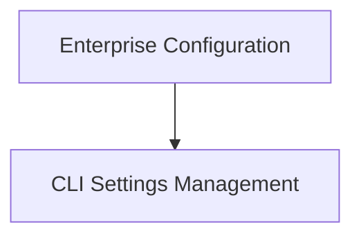

# CLI Configuration Module

## Introduction

The `cli_configuration` module is responsible for managing various configuration settings for the CrewAI Command Line Interface (CLI). It allows users to configure enterprise-specific settings, list existing configurations, set new parameters, and reset configurations to their default states.

## Architecture Overview

The `cli_configuration` module is structured into distinct sub-modules, each handling a specific aspect of CLI configuration. These sub-modules interact to provide a comprehensive configuration management system.

<!-- DIAGRAM_JSON
{
    "direction": "TD",
    "nodes": [
        {"id": "enterprise_configuration", "label": "Enterprise Configuration", "type": "module", "link": "enterprise_configuration.md"},
        {"id": "settings_management", "label": "CLI Settings Management", "type": "module", "link": "settings_management.md"}
    ],
    "edges": [
        {"source": "enterprise_configuration", "target": "settings_management"}
    ],
    "groups": []
}
-->

## Sub-modules

### [Enterprise Configuration](enterprise_configuration.md)
This sub-module handles enterprise-specific configurations, particularly OAuth2 settings for CrewAI AMP.

### [CLI Settings Management](settings_management.md)
This sub-module provides functionality to list, set, and reset all command-line interface configuration parameters.