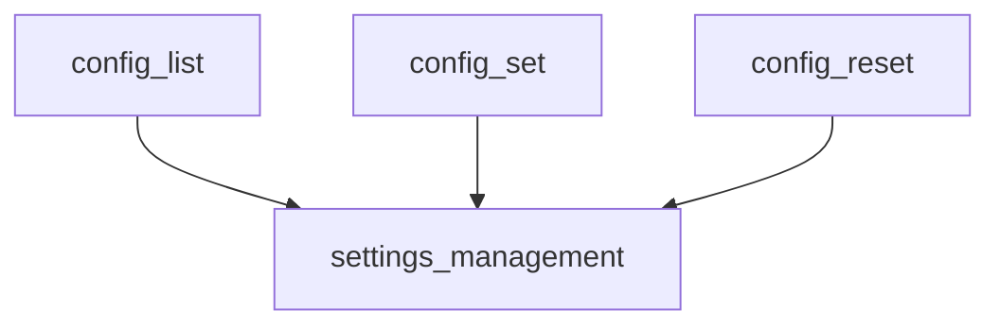

# `cli_configuration_commands` Module Documentation

## Introduction

The `cli_configuration_commands` module provides the core command-line interface (CLI) functionalities for managing CrewAI's configuration settings. It allows users to list, set, and reset various configuration parameters directly from the command line, ensuring flexible control over the application's behavior.

## Architecture and Component Relationships

This module acts as an interface to the underlying configuration management logic, primarily interacting with the `SettingsCommand` class, which is part of the `settings_management` module. Each function within `cli_configuration_commands` instantiates a `SettingsCommand` object and delegates the actual configuration operations to it.

<!-- DIAGRAM_JSON
{
    "direction": "TD",
    "nodes": [
        {"id": "config_list", "label": "config_list", "type": "component", "link": null},
        {"id": "config_set", "label": "config_set", "type": "component", "link": null},
        {"id": "config_reset", "label": "config_reset", "type": "component", "link": null},
        {"id": "settings_management", "label": "settings_management", "type": "external", "link": "settings_management.md"}
    ],
    "edges": [
        {"source": "config_list", "target": "settings_management"},
        {"source": "config_set", "target": "settings_management"},
        {"source": "config_reset", "target": "settings_management"}
    ],
    "groups": []
}
-->



## Module Components

### `config_list()`

This function lists all currently configured CLI parameters. It initializes a `SettingsCommand` object and calls its `list()` method to retrieve and display the settings.

```python
def config_list() -> None:
    """List all CLI configuration parameters."""
    config_command = SettingsCommand()
    config_command.list()
```

### `config_set(key: str, value: str)`

This function allows setting a specific CLI configuration parameter. It takes a `key` and a `value` as arguments, instantiates `SettingsCommand`, and then uses its `set()` method to update the configuration.

```python
def config_set(key: str, value: str) -> None:
    """Set a CLI configuration parameter."""
    config_command = SettingsCommand()
    config_command.set(key, value)
```

### `config_reset()`

This function resets all CLI configuration parameters to their default values. It creates a `SettingsCommand` object and invokes its `reset_all_settings()` method.

```python
def config_reset() -> None:
    """Reset all CLI configuration parameters to default values."""
    config_command = SettingsCommand()
    config_command.reset_all_settings()
```

## How it Fits into the Overall System

The `cli_configuration_commands` module is an integral part of the `crewai_cli` ecosystem. It resides under `crewai_cli.cli_configuration.settings_management`, specifically handling the direct user interaction for configuration through the command line. It relies on the `settings_management` module ([settings_management.md](settings_management.md)) to perform the actual persistence and retrieval of configuration data, ensuring a clear separation of concerns between the user interface and the backend logic.
