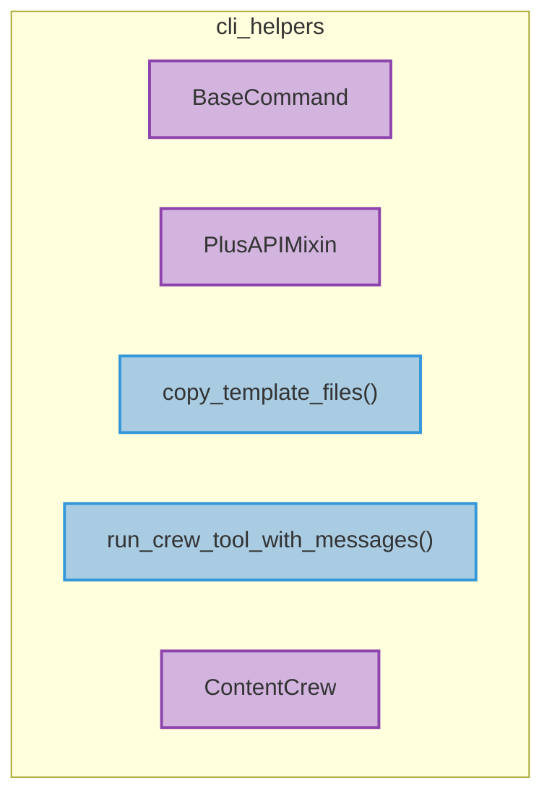

# cli_helpers
This module provides helper utilities and base classes for the CrewAI command-line interface, including command definitions, API interactions, file templating, and crew execution.

<!-- DIAGRAM_JSON
{
    "nodes": [
        {
            "id": "BaseCommand",
            "label": "BaseCommand",
            "type": "class"
        },
        {
            "id": "PlusAPIMixin",
            "label": "PlusAPIMixin",
            "type": "class"
        },
        {
            "id": "copy_template_files",
            "label": "copy_template_files",
            "type": "function"
        },
        {
            "id": "run_crew_tool_with_messages",
            "label": "run_crew_tool_with_messages",
            "type": "function"
        },
        {
            "id": "ContentCrew",
            "label": "ContentCrew",
            "type": "class"
        }
    ],
    "edges": [],
    "groups": []
}
-->
