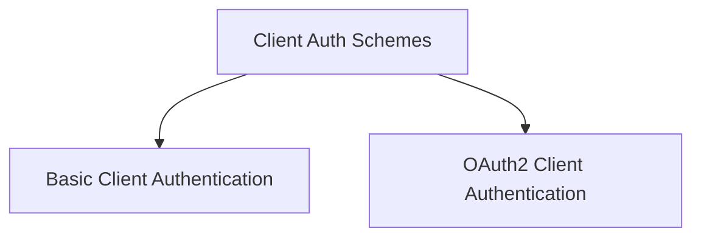

# Client Authentication Schemes

The `client_auth_schemes` module provides a comprehensive set of classes for handling various client-side authentication mechanisms. It enables secure communication by offering different authentication methods such as API keys, Bearer tokens, HTTP Basic/Digest authentication, and OAuth2 flows (Client Credentials and Authorization Code).

## Architecture Overview

This module is a core part of the `a2a_auth_schemes` module, focusing specifically on client-side authentication. It is structured into two main sub-modules:

- **Basic Client Authentication Schemes**: Covers fundamental authentication types.
- **OAuth2 Client Authentication Schemes**: Dedicated to the more complex OAuth2 flows.

These sub-modules encapsulate specific authentication logic, ensuring modularity and ease of maintenance. The `client_auth_schemes` module itself serves as an aggregation point, providing a unified interface for clients to select and configure their desired authentication method.

<!-- DIAGRAM_JSON
{
    "direction": "TD",
    "nodes": [
        {"id": "client_auth_schemes", "label": "Client Auth Schemes", "type": "module"},
        {"id": "basic_client_auth", "label": "Basic Client Auth", "type": "module", "link": "basic_client_auth.md"},
        {"id": "oauth2_client_auth", "label": "OAuth2 Client Auth", "type": "module", "link": "oauth2_client_auth.md"}
    ],
    "edges": [
        {"source": "client_auth_schemes", "target": "basic_client_auth"},
        {"source": "client_auth_schemes", "target": "oauth2_client_auth"}
    ],
    "groups": []
}
-->

## Sub-modules

### [Basic Client Authentication Schemes](basic_client_auth.md)
This sub-module provides classes for common client-side authentication methods like API Key, Bearer Token, HTTP Basic, and HTTP Digest authentication.

### [OAuth2 Client Authentication Schemes](oauth2_client_auth.md)
This sub-module implements OAuth2 client-side authentication flows, including Client Credentials and Authorization Code grants.
