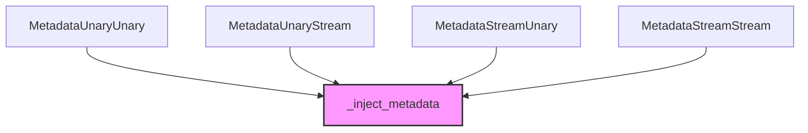

# client_metadata_interceptors Module Documentation

## Introduction
The `client_metadata_interceptors` module provides core gRPC client interceptors essential for secure and contextual Agent-to-Agent (A2A) communication within the CrewAI framework. These interceptors are responsible for injecting authentication and other necessary metadata into outgoing gRPC requests, ensuring proper delegation and secure interactions between agents.

## Purpose and Core Functionality
This module defines specific interceptors for each type of gRPC client call (unary-unary, unary-stream, stream-unary, and stream-stream). Their primary function is to transparently add metadata to `client_call_details` before the request is sent, typically for authentication purposes or to propagate contextual information across delegated calls. This mechanism is crucial for maintaining security and operational context in distributed agent systems.

## Architecture and Component Relationships

The module contains four main interceptor classes, each designed for a specific gRPC call pattern:

### 1. `MetadataUnaryUnary`
This interceptor handles unary-unary gRPC calls, where both the request and response are single messages. It intercepts the call and injects metadata before passing control to the next handler in the chain.
- **Core Component**: `lib.crewai.src.crewai.a2a.utils.delegation.MetadataUnaryUnary`

### 2. `MetadataUnaryStream`
This interceptor is used for unary-stream gRPC calls, where a single request message results in a stream of response messages. It ensures that metadata is included at the beginning of such a call.
- **Core Component**: `lib.crewai.src.crewai.a2a.utils.delegation.MetadataUnaryStream`

### 3. `MetadataStreamUnary`
Responsible for stream-unary gRPC calls, this interceptor handles scenarios where a stream of request messages leads to a single response message. It injects the necessary metadata for the overall call context.
- **Core Component**: `lib.crewai.src.crewai.a2a.utils.delegation.MetadataStreamUnary`

### 4. `MetadataStreamStream`
This interceptor manages stream-stream gRPC calls, where both requests and responses are continuous streams. It ensures that the metadata is correctly applied to the initial call details.
- **Core Component**: `lib.crewai.src.crewai.a2a.utils.delegation.MetadataStreamStream`

All these interceptors rely on an internal `_inject_metadata` utility, which is responsible for the actual process of constructing and adding the metadata to the `client_call_details`. This utility is part of the broader [a2a_delegation_utils module](a2a_delegation_utils.md).

<!-- DIAGRAM_JSON
{
    "direction": "TD",
    "nodes": [
        {"id": "metadata_unary_unary", "label": "MetadataUnaryUnary", "type": "component", "link": null},
        {"id": "metadata_unary_stream", "label": "MetadataUnaryStream", "type": "component", "link": null},
        {"id": "metadata_stream_unary", "label": "MetadataStreamUnary", "type": "component", "link": null},
        {"id": "metadata_stream_stream", "label": "MetadataStreamStream", "type": "component", "link": null},
        {"id": "inject_metadata", "label": "_inject_metadata", "type": "external", "link": "a2a_delegation_utils.md"}
    ],
    "edges": [
        {"source": "metadata_unary_unary", "target": "inject_metadata"},
        {"source": "metadata_unary_stream", "target": "inject_metadata"},
        {"source": "metadata_stream_unary", "target": "inject_metadata"},
        {"source": "metadata_stream_stream", "target": "inject_metadata"}
    ],
    "groups": []
}
-->

## How the Module Fits into the Overall System
The `client_metadata_interceptors` module is a crucial part of the [a2a_delegation_utils module](a2a_delegation_utils.md), which itself is a sub-module of the larger [crewai_agent_to_agent_communication module](crewai_agent_to_agent_communication.md). These interceptors provide the foundational mechanism for secure and stateful agent delegation by ensuring that all outgoing gRPC communications from an agent client include the necessary authentication and contextual metadata. They enable CrewAI agents to interact with other agents or services securely and correctly, propagating security contexts or other relevant information seamlessly across calls.
