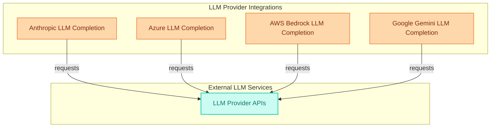

# Cloud LLM Provider Integrations
This module integrates with various cloud-based Large Language Model (LLM) providers like Anthropic, Azure, AWS Bedrock, and Google Gemini, enabling native completion, streaming, and tool-calling capabilities.

<!-- DIAGRAM_JSON
{
    "direction": "TD",
    "nodes": [
        {"id": "anthropic_completion_node", "label": "Anthropic LLM Completion", "type": "module", "link": "cloud_llm_providers.md"},
        {"id": "azure_completion_node", "label": "Azure LLM Completion", "type": "module", "link": "cloud_llm_providers.md"},
        {"id": "bedrock_completion_node", "label": "AWS Bedrock LLM Completion", "type": "module", "link": "cloud_llm_providers.md"},
        {"id": "gemini_completion_node", "label": "Google Gemini LLM Completion", "type": "module", "link": "cloud_llm_providers.md"},
        {"id": "llm_provider_api", "label": "LLM Provider APIs", "type": "external"}
    ],
    "edges": [
        {"source": "anthropic_completion_node", "target": "llm_provider_api", "label": "requests"},
        {"source": "azure_completion_node", "target": "llm_provider_api", "label": "requests"},
        {"source": "bedrock_completion_node", "target": "llm_provider_api", "label": "requests"},
        {"source": "gemini_completion_node", "target": "llm_provider_api", "label": "requests"}
    ],
    "groups": [
        {"id": "integrations", "label": "LLM Provider Integrations", "role": "generative", "nodes": ["anthropic_completion_node", "azure_completion_node", "bedrock_completion_node", "gemini_completion_node"]},
        {"id": "external", "label": "External LLM Services", "role": "external", "nodes": ["llm_provider_api"]}
    ]
}
-->
