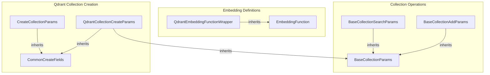

# collection_and_embeddings
This module defines core interfaces for collection management and embedding functions, including base parameter structures and Qdrant-specific implementations.

<!-- DIAGRAM_JSON
{
  "nodes": [
    {
      "id": "BaseCollectionAddParams",
      "label": "BaseCollectionAddParams"
    },
    {
      "id": "BaseCollectionSearchParams",
      "label": "BaseCollectionSearchParams"
    },
    {
      "id": "EmbeddingFunction",
      "label": "EmbeddingFunction"
    },
    {
      "id": "QdrantEmbeddingFunctionWrapper",
      "label": "QdrantEmbeddingFunctionWrapper"
    },
    {
      "id": "QdrantCollectionCreateParams",
      "label": "QdrantCollectionCreateParams"
    },
    {
      "id": "CreateCollectionParams",
      "label": "CreateCollectionParams"
    }
  ],
  "edges": [
    {
      "source": "BaseCollectionAddParams",
      "target": "BaseCollectionParams",
      "type": "inheritance"
    },
    {
      "source": "BaseCollectionSearchParams",
      "target": "BaseCollectionParams",
      "type": "inheritance"
    },
    {
      "source": "QdrantEmbeddingFunctionWrapper",
      "target": "EmbeddingFunction",
      "type": "inheritance"
    },
    {
      "source": "QdrantCollectionCreateParams",
      "target": "BaseCollectionParams",
      "type": "inheritance"
    },
    {
      "source": "QdrantCollectionCreateParams",
      "target": "CommonCreateFields",
      "type": "inheritance"
    },
    {
      "source": "CreateCollectionParams",
      "target": "CommonCreateFields",
      "type": "inheritance"
    }
  ],
  "groups": [
    {
      "id": "Collection Operations",
      "label": "Collection Operations",
      "nodes": [
        "BaseCollectionAddParams",
        "BaseCollectionSearchParams"
      ]
    },
    {
      "id": "Embedding Definitions",
      "label": "Embedding Definitions",
      "nodes": [
        "EmbeddingFunction",
        "QdrantEmbeddingFunctionWrapper"
      ]
    },
    {
      "id": "Qdrant Collection Creation",
      "label": "Qdrant Collection Creation",
      "nodes": [
        "QdrantCollectionCreateParams",
        "CreateCollectionParams"
      ]
    }
  ]
}
-->
