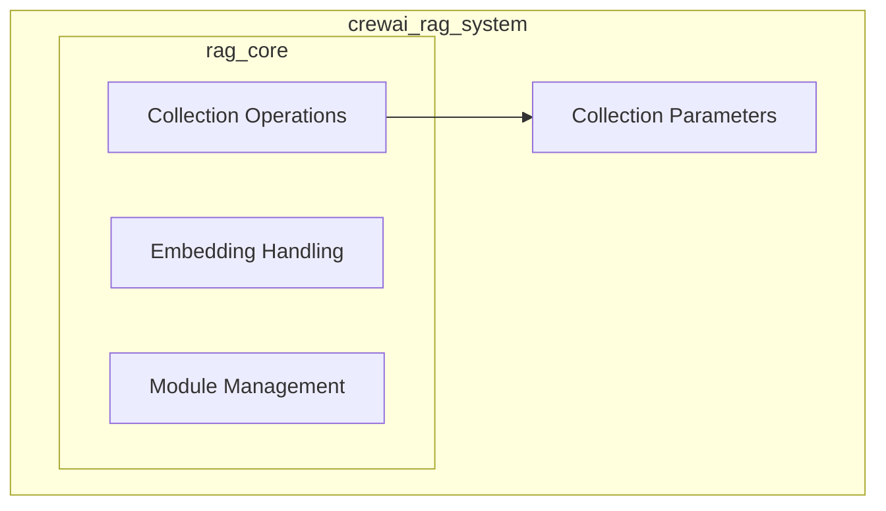

# Collection Operations Module

## Introduction
The `collection_operations` module within the `crewai_rag_system.rag_core` is responsible for defining the fundamental parameters used in managing document collections for Retrieval-Augmented Generation (RAG). It provides standardized structures for adding new documents and performing searches within these collections, ensuring consistency and ease of integration across different RAG clients.

## Architecture
The `collection_operations` module primarily consists of parameter definitions that support various data manipulation tasks within RAG collections. It interfaces with other components of the RAG system by providing structured data for operations like adding and searching documents.

<!-- DIAGRAM_JSON
{
    "direction": "TD",
    "nodes": [
        {"id": "collection_parameters", "label": "Collection Parameters", "type": "module", "link": "collection_parameters.md"}
    ],
    "edges": []
}
-->

## Sub-modules

### [Collection Parameters](collection_parameters.md)
This sub-module defines the essential parameters required for interacting with RAG document collections, including structures for adding documents and specifying search queries and filters.

## Relationship to Overall System
The `collection_operations` module is a core part of the `crewai_rag_system.rag_core`. It provides the foundational data structures (`BaseCollectionAddParams` and `BaseCollectionSearchParams`) that are utilized by various RAG clients and integrations (like `qdrant_integration` and `chromadb_integration`) to perform their respective tasks. By centralizing these parameter definitions, it ensures a consistent and robust interface for all collection-related interactions within the RAG system.
