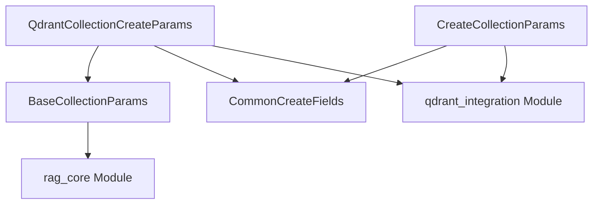
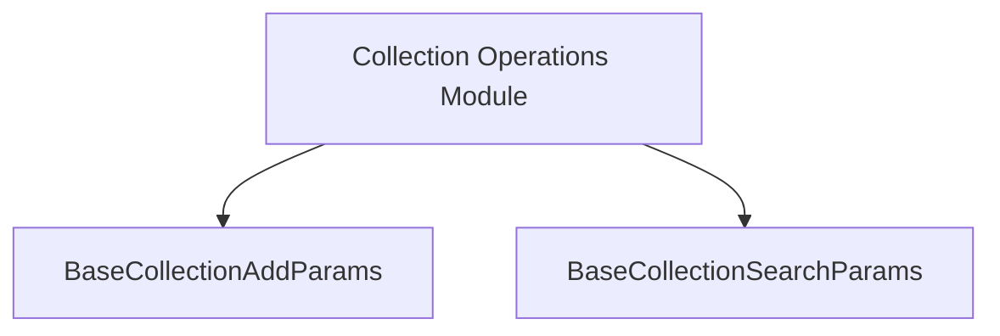

The `collection_parameters` module, located within `crewai_rag_system.qdrant_integration.qdrant_types`, defines the data structures essential for managing Qdrant collections within the RAG (Retrieval-Augmented Generation) system. It provides clear, structured parameters for creating new Qdrant collections, facilitating seamless integration and operation with the Qdrant vector database.

### Purpose and Core Functionality

The primary purpose of this module is to standardize and encapsulate the parameters required for Qdrant collection operations. It offers two main parameter classes:

1.  **`QdrantCollectionCreateParams`**: This class defines high-level parameters for the creation of a Qdrant collection. It extends `BaseCollectionParams` (presumably from the core RAG system for general collection parameters) and `CommonCreateFields`, providing a comprehensive set of options for configuring a new Qdrant collection. This abstraction allows for a more unified approach to collection creation across different RAG providers while enabling Qdrant-specific configurations.

2.  **`CreateCollectionParams`**: This class is designed to hold parameters that directly map to the `qdrant_client.create_collection` method. It inherits from `CommonCreateFields` and explicitly includes `collection_name`, which is crucial for identifying and interacting with Qdrant collections. This class acts as a direct interface to the Qdrant client\'s collection creation functionality, ensuring that all necessary parameters are available and correctly structured for low-level Qdrant operations.

Together, these classes ensure that collection creation is both flexible (through `QdrantCollectionCreateParams` for high-level RAG integration) and precise (through `CreateCollectionParams` for direct Qdrant client interaction).

### Architecture and Component Relationships

The `collection_parameters` module defines two core parameter classes: `QdrantCollectionCreateParams` and `CreateCollectionParams`. These classes leverage inheritance to build upon more general parameter definitions.

-   `CommonCreateFields`: This is a base class that provides common fields required for creating collections, shared across different parameter definitions within the Qdrant integration.
-   `BaseCollectionParams`: This is another base class, likely originating from the broader `rag_core` module, defining fundamental parameters applicable to various RAG collection types.

The relationships are as follows:
-   `QdrantCollectionCreateParams` inherits from both `BaseCollectionParams` and `CommonCreateFields`.
-   `CreateCollectionParams` inherits from `CommonCreateFields`.

This structure promotes reusability and consistency in defining collection creation parameters.

<!-- DIAGRAM_JSON
{
    "direction": "TD",
    "nodes": [
        {"id": "qdrant_collection_create_params", "label": "QdrantCollectionCreateParams", "type": "component", "link": null},
        {"id": "create_collection_params", "label": "CreateCollectionParams", "type": "component", "link": null},
        {"id": "common_create_fields", "label": "CommonCreateFields", "type": "component", "link": null},
        {"id": "base_collection_params", "label": "BaseCollectionParams", "type": "component", "link": null},
        {"id": "qdrant_integration", "label": "qdrant_integration", "type": "external", "link": "qdrant_integration.md"},
        {"id": "rag_core", "label": "rag_core", "type": "external", "link": "rag_core.md"}
    ],
    "edges": [
        {"source": "qdrant_collection_create_params", "target": "base_collection_params"},
        {"source": "qdrant_collection_create_params", "target": "common_create_fields"},
        {"source": "create_collection_params", "target": "common_create_fields"},
        {"source": "qdrant_collection_create_params", "target": "qdrant_integration"},
        {"source": "create_collection_params", "target": "qdrant_integration"},
        {"source": "base_collection_params", "target": "rag_core"}
    ],
    "groups": []
}
-->

### How the Module Fits into the Overall System

The `collection_parameters` module plays a crucial role in the `crewai_rag_system`, specifically within the `qdrant_integration`. It acts as the foundational layer for defining how RAG collections are created and managed in Qdrant.

-   **Qdrant Integration**: The `qdrant_integration` module relies on these parameter classes to construct and execute commands against the Qdrant vector database. When a new RAG collection needs to be set up using Qdrant, the parameters defined here guide the creation process.
-   **RAG Core System**: While directly nested under `qdrant_integration`, `QdrantCollectionCreateParams` also inherits from `BaseCollectionParams`, suggesting a connection to the more general `rag_core` module. This indicates that the Qdrant-specific collection parameters are designed to align with broader RAG collection management principles defined at the core system level.
-   **Extensibility**: By centralizing collection creation parameters, this module ensures that future enhancements or modifications to Qdrant collection management can be implemented systematically, maintaining consistency across the RAG system.

In essence, `collection_parameters` provides the necessary blueprints for the `crewai_rag_system` to effectively interact with Qdrant for managing RAG collections.
1.  **`BaseCollectionAddParams`**:
    *   **Purpose**: Specifies the parameters for adding documents to a RAG collection.
    *   **Attributes**:
        *   `collection_name` (inherited from `BaseCollectionParams`): The target collection's name.
        *   `documents` (Required): A list of dictionaries, where each dictionary represents a document following the `BaseRecord` structure.
        *   `batch_size` (Optional): An integer specifying the number of documents to process in a single batch, useful for managing token limits or large datasets.

2.  **`BaseCollectionSearchParams`**:
    *   **Purpose**: Outlines the parameters necessary for performing searches within a RAG collection.
    *   **Attributes**:
        *   `collection_name` (inherited from `BaseCollectionParams`): The collection to search within.
        *   `query` (Required): The text string to be used for the search.
        *   `limit` (Optional): An integer defining the maximum number of search results to return.
        *   `metadata_filter` (Optional): A dictionary allowing filtering of results based on document metadata.
        *   `score_threshold` (Optional): A float between 0 and 1, setting the minimum similarity score for results to be included.

### Architecture and Component Relationships

The `collection_parameters` module, as a leaf module, encapsulates these parameter definitions. Both `BaseCollectionAddParams` and `BaseCollectionSearchParams` extend `BaseCollectionParams`, suggesting a common base for all collection-related parameter configurations within the RAG system. These parameter classes are consumed by the [collection_operations](collection_operations.md) module, which handles the actual logic of interacting with RAG collections for adding and searching documents.

<!-- DIAGRAM_JSON
{
    "direction": "TD",
    "nodes": [
        {"id": "add_params", "label": "BaseCollectionAddParams", "type": "component", "link": null},
        {"id": "search_params", "label": "BaseCollectionSearchParams", "type": "component", "link": null},
        {"id": "collection_operations_module", "label": "Collection Operations Module", "type": "external", "link": "collection_operations.md"}
    ],
    "edges": [
        {"source": "collection_operations_module", "target": "add_params"},
        {"source": "collection_operations_module", "target": "search_params"}
    ],
    "groups": []
}
-->

### How the Module Fits into the Overall System

The `collection_parameters` module is an integral part of the `crewai_rag_system`, specifically residing within `rag_core` and its `collection_operations` sub-module. It provides the standardized data structures that enable the `collection_operations` module to effectively communicate with underlying RAG clients (like Qdrant or ChromaDB) for tasks such as indexing new documents and retrieving relevant information. By centralizing these parameter definitions, the module ensures that all RAG collection interactions adhere to a consistent interface, promoting maintainability and simplifying future extensions or integrations with different RAG providers.