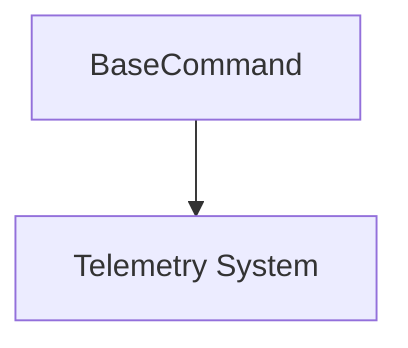

# command_base Module Documentation

## Introduction

The `command_base` module provides the foundational `BaseCommand` class for all Command Line Interface (CLI) commands within the CrewAI system. Its primary purpose is to establish a standardized base for CLI operations, ensuring that every command automatically incorporates essential functionalities such as telemetry.

## Architecture and Component Relationships

The `command_base` module primarily consists of the `BaseCommand` class, which serves as the entry point for common CLI command logic.

<!-- DIAGRAM_JSON
{
    "direction": "TD",
    "nodes": [
        {"id": "base_command", "label": "BaseCommand", "type": "component", "link": null},
        {"id": "telemetry", "label": "Telemetry System", "type": "external", "link": "crewai_event_system.md"}
    ],
    "edges": [
        {"source": "base_command", "target": "telemetry"}
    ],
    "groups": []
}
-->



### Core Components

#### BaseCommand

`lib.crewai.src.crewai.cli.command.BaseCommand`

The `BaseCommand` class is the abstract base class for all CLI commands. It initializes a telemetry instance for tracking and tracing purposes, ensuring that all commands inheriting from it automatically have telemetry capabilities enabled.

```python
class BaseCommand:
    def __init__(self) -> None:
        self._telemetry = Telemetry()
        self._telemetry.set_tracer()
```

## System Integration

The `command_base` module is a critical part of the `crewai_cli` module, located under `crewai_cli/cli_base_commands`. It defines the fundamental structure and initial setup for all CLI commands, promoting consistency and reusability across the command-line interface. Any new CLI command developed for CrewAI is expected to inherit from `BaseCommand`, thereby gaining immediate access to shared functionalities like telemetry and ensuring adherence to the overall CLI architecture.

It interacts with the [crewai_event_system](crewai_event_system.md) for telemetry, which is crucial for monitoring and debugging CLI command executions. This integration allows for insights into command usage and performance, aiding in system maintenance and improvement.