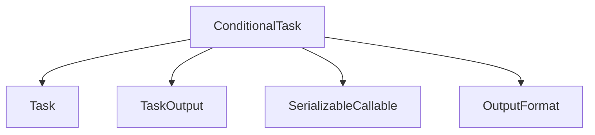

# `conditional_task_logic`

The `conditional_task_logic` module provides the `ConditionalTask` class, enabling the creation of tasks that execute dynamically based on the outcome of preceding tasks. This functionality is crucial for building flexible and intelligent workflows where subsequent actions depend on earlier results.

## Module Architecture

The `conditional_task_logic` module revolves around the `ConditionalTask` component. It extends the base `Task` class, introducing a `condition` attribute that is a callable function. This function evaluates the output of a previous task to decide whether the `ConditionalTask` should proceed or be skipped.

<!-- DIAGRAM_JSON
{
    "direction": "TD",
    "nodes": [
        {"id": "conditional_task", "label": "ConditionalTask", "type": "component", "link": null},
        {"id": "task", "label": "Task", "type": "external", "link": "crewai_task_management.md"},
        {"id": "task_output", "label": "TaskOutput", "type": "external", "link": "crewai_core_types.md"},
        {"id": "serializable_callable", "label": "SerializableCallable", "type": "external", "link": "crewai_utilities.md"},
        {"id": "output_format", "label": "OutputFormat", "type": "external", "link": "crewai_core_types.md"}
    ],
    "edges": [
        {"source": "conditional_task", "target": "task"},
        {"source": "conditional_task", "target": "task_output"},
        {"source": "conditional_task", "target": "serializable_callable"},
        {"source": "conditional_task", "target": "output_format"}
    ],
    "groups": []
}
-->



### Component Details

#### `ConditionalTask`

```python
class ConditionalTask(Task):
    """A task that can be conditionally executed based on the output of another task.

    This task type allows for dynamic workflow execution based on the results of
    previous tasks in the crew execution chain.

    Attributes:
        condition: Function that evaluates previous task output to determine execution.

    Notes:
        - Cannot be the only task in your crew
        - Cannot be the first task since it needs context from the previous task
    """

    condition: SerializableCallable | None = Field(
        default=None,
        description="Function that determines whether the task should be executed based on previous task output.",
    )

    def __init__(
        self,
        condition: Callable[[Any], bool] | None = None,
        **kwargs: Any,
    ) -> None:
        super().__init__(**kwargs)
        self.condition = condition

    def should_execute(self, context: TaskOutput) -> bool:
        """Determines whether the conditional task should be executed based on the provided context.

        Args:
            context: The output from the previous task that will be evaluated by the condition.

        Returns:
            True if the task should be executed, False otherwise.

        Raises:
            ValueError: If no condition function is set.
        """
        if self.condition is None:
            raise ValueError("No condition function set for conditional task")
        return bool(self.condition(context))

    def get_skipped_task_output(self) -> TaskOutput:
        """Generate a TaskOutput for when the conditional task is skipped.

        Returns:
            Empty TaskOutput with RAW format indicating the task was skipped.
        """
        return TaskOutput(
            description=self.description,
            raw="",
            agent=self.agent.role if self.agent else "",
            output_format=OutputFormat.RAW,
        )
```

Extends the base `Task` class to add conditional execution logic. The `condition` attribute holds a function that takes the `TaskOutput` of the previous task and returns a boolean, dictating whether the `ConditionalTask` should be executed.

### Key Methods:

*   **`__init__(self, condition: Callable[[Any], bool] | None = None, **kwargs: Any) -> None`**:
    Initializes the `ConditionalTask` instance, setting the condition function.

*   **`should_execute(self, context: TaskOutput) -> bool`**:
    Evaluates the provided `context` (output from the previous task) against the `condition` function. Raises a `ValueError` if no condition is set.

*   **`get_skipped_task_output(self) -> TaskOutput`**:
    Generates a `TaskOutput` instance with an empty `raw` field and `RAW` output format, indicating that the task was skipped due to its condition not being met.

## Integration with the Overall System

The `conditional_task_logic` module is an integral part of the [crewai_task_management](crewai_task_management.md) system. It allows developers to define complex task flows where certain tasks are only performed if specific criteria are met, based on the outcomes of earlier tasks. This enhances the flexibility and adaptability of agents within a CrewAI application, enabling more sophisticated decision-making processes in automated workflows.

This module depends on the base `Task` class, likely defined within the `crewai_task_management` or a core types module. It also uses `SerializableCallable` from [crewai_utilities](crewai_utilities.md) for handling the condition function and `TaskOutput` and `OutputFormat` from [crewai_core_types](crewai_core_types.md) for managing task results.