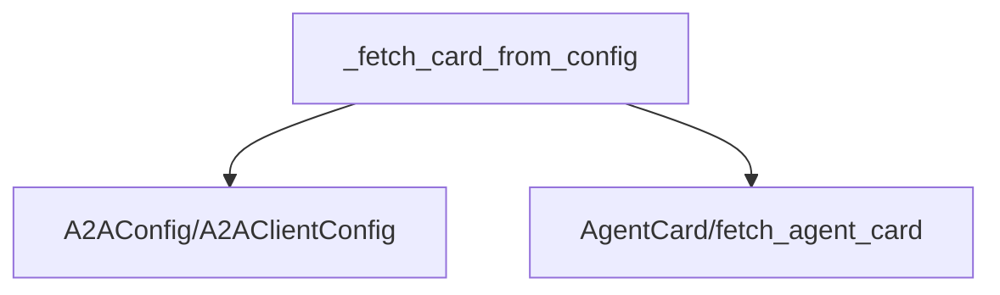

# config_card_fetcher Module Documentation

## Introduction
The `config_card_fetcher` module is a crucial component within the CrewAI framework, specifically designed to handle the retrieval of agent configuration cards for Agent-to-Agent (A2A) communication. It provides the core functionality for fetching `AgentCard` objects, which contain essential metadata about remote agents, enabling seamless inter-agent interactions.

## Core Functionality
The primary function of this module is `_fetch_card_from_config`.

### `_fetch_card_from_config`
```python
def _fetch_card_from_config(
    config: A2AConfig | A2AClientConfig,
) -> tuple[A2AConfig | A2AClientConfig, AgentCard | Exception]:
    """Fetch agent card from A2A config.

    Args:
        config: A2A configuration

    Returns:
        Tuple of (config, card or exception)
    """
    try:
        card = fetch_agent_card(
            endpoint=config.endpoint,
            auth=config.auth,
            timeout=config.timeout,
        )
        return config, card
    except Exception as e:
        return config, e
```
This function is responsible for taking an A2A configuration object (either `A2AConfig` or `A2AClientConfig`) and using it to fetch an `AgentCard`. It encapsulates the logic for connecting to an agent's endpoint, authenticating, and retrieving its card. In case of any errors during the fetching process, it gracefully catches exceptions and returns them, allowing the calling components to handle failures appropriately.

## Architecture and Component Relationships

<!-- DIAGRAM_JSON
{
    "direction": "TD",
    "nodes": [
        {"id": "config_card_fetcher", "label": "_fetch_card_from_config", "type": "component", "link": null},
        {"id": "a2a_config", "label": "A2AConfig/A2AClientConfig", "type": "external", "link": "a2a_config.md"},
        {"id": "a2a_agent_card_utils", "label": "AgentCard/fetch_agent_card", "type": "external", "link": "a2a_agent_card_utils.md"}
    ],
    "edges": [
        {"source": "config_card_fetcher", "target": "a2a_config"},
        {"source": "config_card_fetcher", "target": "a2a_agent_card_utils"}
    ],
    "groups": []
}
-->



The diagram above illustrates the key relationships within the `config_card_fetcher` module:
-   **`_fetch_card_from_config`**: The core function of this module, responsible for initiating the agent card retrieval process.
-   **`a2a_config`**: This external module provides the `A2AConfig` and `A2AClientConfig` data structures, which are used as input to `_fetch_card_from_config` to specify the remote agent's endpoint, authentication details, and timeout settings.
-   **`a2a_agent_card_utils`**: This external module provides both the `AgentCard` type (which is returned by the fetching process) and the `fetch_agent_card` function, which `_fetch_card_from_config` utilizes to perform the actual network request and parsing of the agent card.

## How the Module Fits into the Overall System
The `config_card_fetcher` module is nested within the `a2a_wrapper` sub-module, which is part of the larger `crewai_agent_to_agent_communication` module. Its role is fundamental to enabling robust Agent-to-Agent communication within CrewAI.

Before agents can delegate tasks or communicate effectively, they need to understand the capabilities and configuration of their peers. This module serves as the initial step in that process by providing a reliable way to fetch this critical `AgentCard` information. The fetched `AgentCard`s are then utilized by other components within the [a2a_wrapper.md](a2a_wrapper.md) module, such as the `agent_kickoff_wrapper` and `task_execution_wrapper`, to determine how to interact with remote agents, orchestrate task delegation, and handle responses.

By abstracting away the complexities of fetching agent configurations, `config_card_fetcher` ensures that other parts of the A2A communication system can focus on their core logic, promoting modularity and maintainability of the CrewAI framework.
