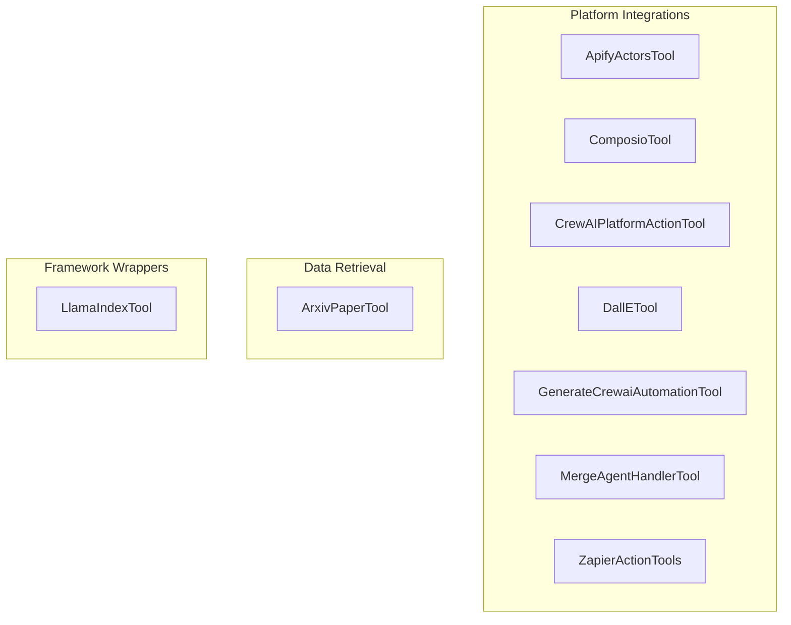

# content_and_platform
This module provides a collection of tools for interacting with various external platforms, content sources, and AI frameworks, enabling agents to perform diverse tasks.

<!-- DIAGRAM_JSON
{
  "nodes": [
    {"id": "A1", "label": "ApifyActorsTool"},
    {"id": "A2", "label": "ArxivPaperTool"},
    {"id": "C1", "label": "ComposioTool"},
    {"id": "C2", "label": "CrewAIPlatformActionTool"},
    {"id": "D1", "label": "DallETool"},
    {"id": "G1", "label": "GenerateCrewaiAutomationTool"},
    {"id": "L1", "label": "LlamaIndexTool"},
    {"id": "M1", "label": "MergeAgentHandlerTool"},
    {"id": "Z1", "label": "ZapierActionTools"}
  ],
  "edges": [],
  "groups": [
    {"id": "Platform_Integrations", "label": "Platform Integrations", "nodes": ["A1", "C1", "C2", "D1", "G1", "M1", "Z1"]},
    {"id": "Data_Retrieval", "label": "Data Retrieval", "nodes": ["A2"]},
    {"id": "Framework_Wrappers", "label": "Framework Wrappers", "nodes": ["L1"]}
  ]
}
-->
