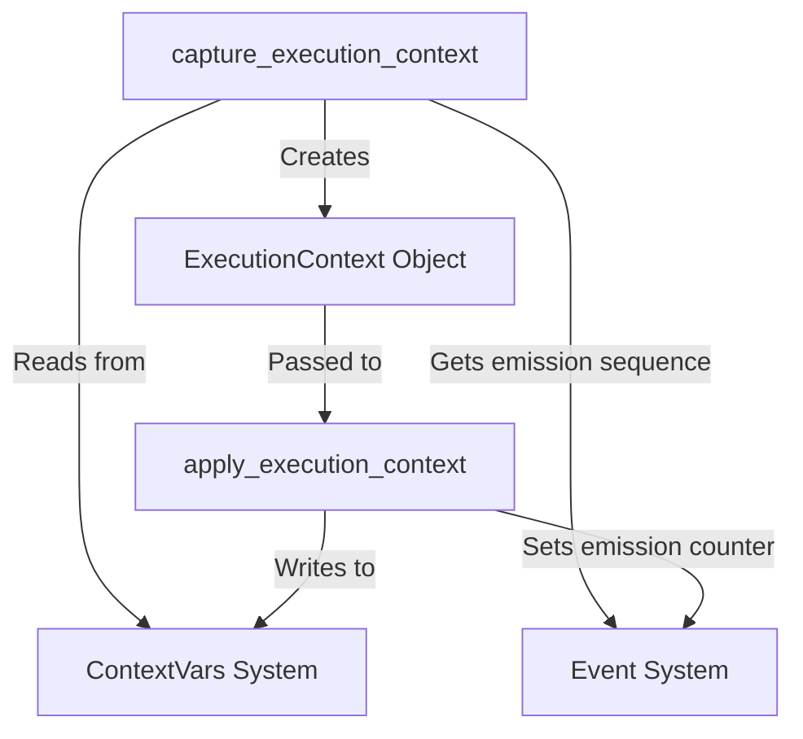

# Module: `context_handling`

## Introduction

The `context_handling` module is responsible for managing the execution context within the CrewAI framework. It provides core functionalities to capture the current operational context into a serializable `ExecutionContext` object and to restore that context back into the `ContextVars` for continued execution. This ensures that asynchronous operations and distributed tasks maintain consistent state information across different execution boundaries.

## Architecture and Component Relationships

This module primarily interacts with Python's `ContextVars` to manage the execution state, including task IDs, flow IDs, and event-related information. It also interfaces with the event system to capture and restore emission sequences, which are crucial for tracking the flow of events within a CrewAI application.

<!-- DIAGRAM_JSON
{
    "direction": "TD",
    "nodes": [
        {"id": "capture_execution_context", "label": "capture_execution_context", "type": "component", "link": null},
        {"id": "apply_execution_context", "label": "apply_execution_context", "type": "component", "link": null},
        {"id": "execution_context_object", "label": "ExecutionContext Object", "type": "component", "link": null},
        {"id": "context_vars_system", "label": "ContextVars System", "type": "external", "link": "context_management.md"},
        {"id": "event_system", "label": "Event System", "type": "external", "link": "crewai_event_system.md"}
    ],
    "edges": [
        {"source": "capture_execution_context", "target": "context_vars_system", "label": "Reads from"},
        {"source": "capture_execution_context", "target": "event_system", "label": "Gets emission sequence"},
        {"source": "capture_execution_context", "target": "execution_context_object", "label": "Creates"},
        {"source": "execution_context_object", "target": "apply_execution_context", "label": "Passed to"},
        {"source": "apply_execution_context", "target": "context_vars_system", "label": "Writes to"},
        {"source": "apply_execution_context", "target": "event_system", "label": "Sets emission counter"}
    ],
    "groups": []
}
-->

### Core Components

#### `capture_execution_context`

This function is responsible for gathering the current state from various `ContextVars` and packaging it into an `ExecutionContext` object. This object encapsulates all relevant contextual information at a given point in time, making it suitable for serialization, passing across process boundaries, or restoring later. It specifically captures:

-   `current_task_id`
-   `flow_request_id`
-   `flow_id`
-   `flow_method_name`
-   `event_id_stack`
-   `last_event_id`
-   `triggering_event_id`
-   `emission_sequence` (obtained from the [Event System](crewai_event_system.md))
-   `feedback_callback_info` (optional)
-   `platform_token`

#### `apply_execution_context`

Conversely, this function takes an `ExecutionContext` object and applies its contained state back to the corresponding `ContextVars`. This effectively restores a previously captured execution context, allowing operations to resume with the correct environmental state. It updates the same set of `ContextVars` that `capture_execution_context` reads from, including setting the emission counter in the [Event System](crewai_event_system.md).

## How the Module Fits into the Overall System

The `context_handling` module is a critical part of the [Execution Context Management](context_management.md) within CrewAI. It provides the fundamental mechanisms for preserving and restoring the operational context, which is essential for:

*   **Asynchronous and Distributed Execution:** Enables tasks and flows to be executed across different threads, processes, or even machines while maintaining their original context.
*   **Flow Persistence and Resumption:** Supports the ability to save the state of a long-running flow and resume it later from the exact point of interruption, ensuring continuity.
*   **Event Tracing and Debugging:** By preserving event IDs and emission sequences, it facilitates comprehensive tracing and debugging of complex multi-agent interactions and workflows.

It works in close conjunction with the broader [CrewAI Execution Context](crewai_execution_context.md) to ensure that agents, tools, and tasks operate within a consistent and traceable environment.
