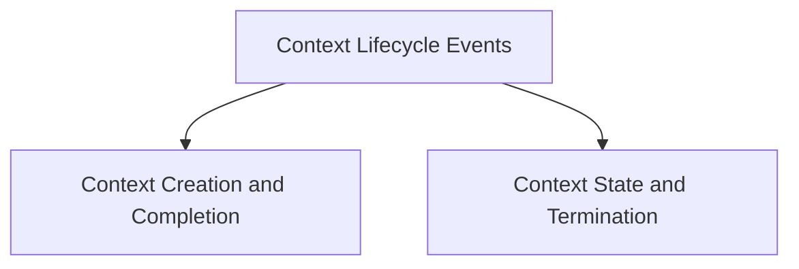

# Context Lifecycle Events

## Introduction
This module defines the events dispatched during the lifecycle of an Agent-to-Agent (A2A) communication context within the CrewAI system. These events provide insights into the creation, state changes, and termination of A2A contexts, which are crucial for monitoring, debugging, and orchestrating agent interactions.

## Architecture Overview
The `context_lifecycle_events` module is part of the broader [crewai_event_system.md](crewai_event_system.md) and specifically falls under [a2a_events.md](a2a_events.md). It categorizes context-related events into two main sub-modules: `context_creation_and_completion` and `context_state_and_termination`.

<!-- DIAGRAM_JSON
{
    "direction": "TD",
    "nodes": [
        {"id": "context_lifecycle_events", "label": "Context Lifecycle Events", "type": "module"},
        {"id": "context_creation_and_completion", "label": "Context Creation and Completion", "type": "module", "link": "context_creation_and_completion.md"},
        {"id": "context_state_and_termination", "label": "Context State and Termination", "type": "module", "link": "context_state_and_termination.md"}
    ],
    "edges": [
        {"source": "context_lifecycle_events", "target": "context_creation_and_completion"},
        {"source": "context_lifecycle_events", "target": "context_state_and_termination"}
    ],
    "groups": []
}
-->

## Sub-modules

### [Context Creation and Completion Events](context_creation_and_completion.md)
This sub-module focuses on events that mark the beginning and successful end of an A2A context. It includes events such as `A2AContextCreatedEvent` and `A2AContextCompletedEvent`.

### [Context State and Termination Events](context_state_and_termination.md)
This sub-module handles events related to changes in the operational status of an A2A context and its explicit removal. It covers events like `A2AContextExpiredEvent`, `A2AContextIdleEvent`, and `A2AContextPrunedEvent`.
