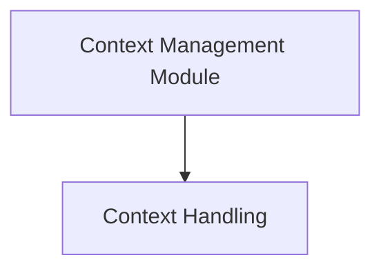

# Context Management Module

The `context_management` module is responsible for capturing and applying execution context within the CrewAI framework. It ensures that crucial contextual information, such as task IDs, flow IDs, and event IDs, is correctly propagated across different asynchronous operations and execution boundaries. This module is vital for maintaining state and traceability throughout complex agent interactions and workflow executions.

## Architecture Overview

The `context_management` module primarily relies on the `context_handling` sub-module to manage the underlying `ContextVars` that store execution context. It acts as the orchestrator for reading from and writing to this shared context, providing a consistent mechanism for context propagation.

<!-- DIAGRAM_JSON
{
    "direction": "TD",
    "nodes": [
        {"id": "context_management_module", "label": "Context Management Module", "type": "module"},
        {"id": "context_handling", "label": "Context Handling", "type": "module", "link": "context_handling.md"}
    ],
    "edges": [
        {"source": "context_management_module", "target": "context_handling"}
    ],
    "groups": []
}
-->

## Sub-modules

### [Context Handling](context_handling.md)
This sub-module encapsulates the core logic for managing the execution context. It provides functions to capture the current state of `ContextVars` into an `ExecutionContext` object and to apply an `ExecutionContext` back into the `ContextVars`, effectively restoring a specific execution state. This ensures that contextual data is available and consistent throughout the execution flow, even across asynchronous calls.
