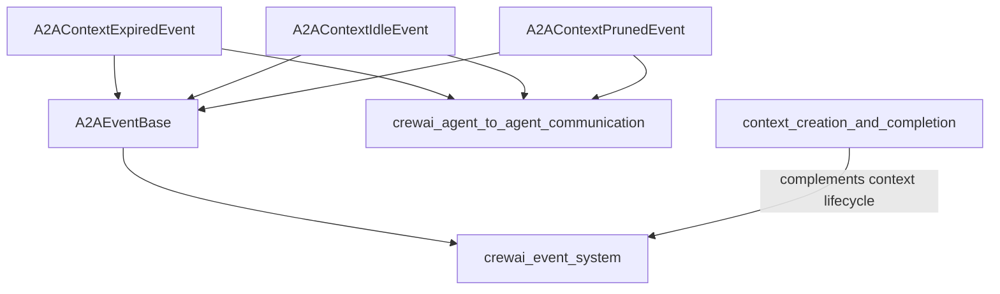

# Module: `context_state_and_termination`

## Introduction

The `context_state_and_termination` module plays a crucial role in the `crewai_event_system` by defining events related to the lifecycle and termination of Agent-to-Agent (A2A) communication contexts. These events provide critical signals that enable the system to react to changes in A2A context states, such as expiration, idleness, or explicit pruning.

## Purpose and Core Functionality

This module encapsulates the definitions for three key A2A context lifecycle events:

### `A2AContextExpiredEvent`

This event is emitted when an A2A context reaches its Time-To-Live (TTL) and expires. It signifies that a context, which was once active for A2A communication, is no longer valid due to timeout. Systems listening to this event can initiate cleanup procedures or transition dependent components to a new state.

**Attributes:**
*   `context_id` (str): The unique identifier of the expired A2A context.
*   `created_at` (float): Unix timestamp indicating when the context was originally created.
*   `age_seconds` (float): The total duration (in seconds) the context existed before expiring.
*   `task_count` (int): The number of tasks associated with the context at the time of expiration.
*   `metadata` (dict[str, Any] | None): Optional custom metadata key-value pairs related to the A2A context.

### `A2AContextIdleEvent`

The `A2AContextIdleEvent` is triggered when an A2A context has experienced a period of inactivity, exceeding a configured idle threshold. This event is vital for resource management, allowing the system to identify and potentially suspend or terminate idle contexts to free up resources.

**Attributes:**
*   `context_id` (str): The unique identifier of the idle A2A context.
*   `idle_seconds` (float): The duration (in seconds) since the last activity occurred within the context.
*   `task_count` (int): The number of tasks currently associated with the idle context.
*   `metadata` (dict[str, Any] | None): Optional custom metadata key-value pairs related to the A2A context.

### `A2AContextPrunedEvent`

This event is emitted when an A2A context is explicitly pruned, meaning it is forcefully removed from the system. Pruning can occur for various reasons, such as administrative actions, error conditions, or when a context is no longer needed. This event allows the system to acknowledge the complete removal of a context and perform any necessary finalization.

**Attributes:**
*   `context_id` (str): The unique identifier of the pruned A2A context.
*   `task_count` (int): The number of tasks that were associated with the context at the time of pruning.
*   `age_seconds` (float): The total duration (in seconds) the context existed before being pruned.
*   `metadata` (dict[str, Any] | None): Optional custom metadata key-value pairs related to the A2A context.

## Architecture and Component Relationships

This module defines specific event types that inherit from a common base class, `A2AEventBase`, which is likely defined within the broader [a2a_events.md](a2a_events.md) module. These event classes serve as data structures to carry information about the state changes of A2A contexts.

The `context_state_and_termination` module is a part of the `context_lifecycle_events` sub-module, which itself resides under [a2a_events.md](a2a_events.md) within the larger [crewai_event_system.md](crewai_event_system.md). It works in conjunction with its sibling module, [context_creation_and_completion.md](context_creation_and_completion.md), to cover the full lifecycle of A2A contexts.

## How the Module Fits into the Overall System

The events defined in `context_state_and_termination` are fundamental for the robust operation of [crewai_agent_to_agent_communication.md](crewai_agent_to_agent_communication.md). By listening to these events, the A2A communication framework can:

*   **Manage Resources:** Automatically clean up or deallocate resources associated with expired or idle contexts.
*   **Maintain State Consistency:** Ensure that all components involved in A2A communication are aware of the current state of contexts.
*   **Enable Reactive Logic:** Trigger specific actions or workflows in response to context state changes, such as notifying agents, logging events, or initiating recovery procedures.

These events provide the necessary feedback mechanism for the `crewai_event_system` to monitor and control the flow of interactions within complex multi-agent setups, ensuring efficient and reliable communication.

<!-- DIAGRAM_JSON
{
    "direction": "TD",
    "nodes": [
        {"id": "A2AContextExpiredEvent_node", "label": "A2AContextExpiredEvent", "type": "component", "link": null},
        {"id": "A2AContextIdleEvent_node", "label": "A2AContextIdleEvent", "type": "component", "link": null},
        {"id": "A2AContextPrunedEvent_node", "label": "A2AContextPrunedEvent", "type": "component", "link": null},
        {"id": "A2AEventBase_node", "label": "A2AEventBase", "type": "external", "link": "a2a_events.md"},
        {"id": "A2A_Communication_Module", "label": "crewai_agent_to_agent_communication", "type": "external", "link": "crewai_agent_to_agent_communication.md"},
        {"id": "Event_System_Module", "label": "crewai_event_system", "type": "external", "link": "crewai_event_system.md"},
        {"id": "Context_Creation_Module", "label": "context_creation_and_completion", "type": "external", "link": "context_creation_and_completion.md"}
    ],
    "edges": [
        {"source": "A2AContextExpiredEvent_node", "target": "A2AEventBase_node"},
        {"source": "A2AContextIdleEvent_node", "target": "A2AEventBase_node"},
        {"source": "A2AContextPrunedEvent_node", "target": "A2AEventBase_node"},
        {"source": "A2AEventBase_node", "target": "Event_System_Module"},
        {"source": "A2AContextExpiredEvent_node", "target": "A2A_Communication_Module"},
        {"source": "A2AContextIdleEvent_node", "target": "A2A_Communication_Module"},
        {"source": "A2AContextPrunedEvent_node", "target": "A2A_Communication_Module"},
        {"source": "Context_Creation_Module", "target": "Event_System_Module", "label": "complements context lifecycle"}
    ],
    "groups": []
}
-->

