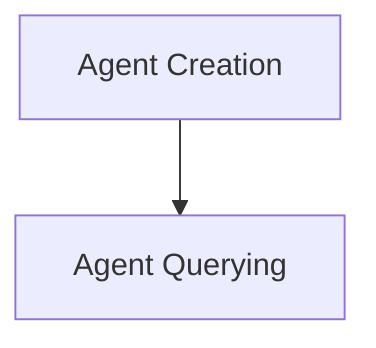

# Contextual AI Tools Module

## Introduction

The `contextualai_tools` module provides a set of tools for interacting with Contextual AI, enabling the creation and querying of RAG (Retrieval Augmented Generation) agents. This module simplifies the process of integrating Contextual AI functionalities into larger systems by offering dedicated tools for agent management and data retrieval.

## Architecture Overview

The module is structured into two main sub-modules, each focusing on a distinct aspect of Contextual AI interaction: agent creation and agent querying. These sub-modules encapsulate the logic for communicating with the Contextual AI platform, handling API calls, document management, and agent interaction.

<!-- DIAGRAM_JSON
{
    "direction": "TD",
    "nodes": [
        {"id": "contextualai_create_agent", "label": "Agent Creation", "type": "module", "link": "contextualai_create_agent.md"},
        {"id": "contextualai_query_agent", "label": "Agent Querying", "type": "module", "link": "contextualai_query_agent.md"}
    ],
    "edges": [
        {"source": "contextualai_create_agent", "target": "contextualai_query_agent"}
    ],
    "groups": []
}
-->

## Sub-modules

### [Agent Creation](contextualai_create_agent.md)
This sub-module is responsible for creating new Contextual AI RAG agents and managing the ingestion of documents into associated datastores. It provides the core functionality to set up new knowledge bases for AI agents.

### [Agent Querying](contextualai_query_agent.md)
This sub-module facilitates querying existing Contextual AI RAG agents. It handles the communication with the agents to retrieve information based on a given query, including mechanisms to wait for document readiness before querying.