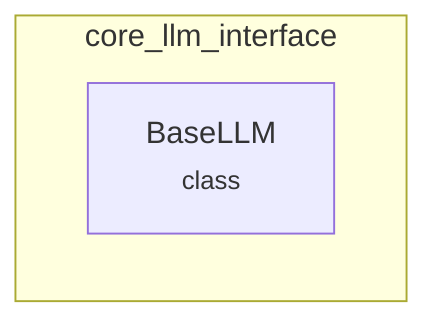

# core_llm_interface
This module defines the `BaseLLM` abstract base class, providing a standardized interface for custom Large Language Model (LLM) implementations within the system.

<!-- DIAGRAM_JSON
{
  "nodes": [
    {
      "id": "BaseLLM",
      "label": "BaseLLM",
      "type": "class"
    }
  ],
  "edges": [],
  "groups": [
    {
      "id": "core_llm_interface",
      "label": "core_llm_interface",
      "nodes": [
        "BaseLLM"
      ]
    }
  ]
}
-->
