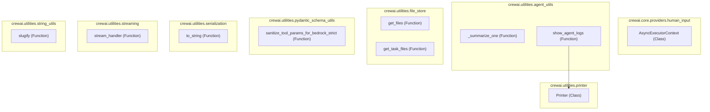

# core_utilities
The `core_utilities` module centralizes essential functions and classes for CrewAI, covering agent logging, file management, data serialization, string manipulation, and asynchronous execution contexts.

<!-- DIAGRAM_JSON
{
    "nodes": [
        {
            "id": "AsyncExecutorContext",
            "label": "AsyncExecutorContext",
            "type": "class"
        },
        {
            "id": "_summarize_one",
            "label": "_summarize_one",
            "type": "function"
        },
        {
            "id": "show_agent_logs",
            "label": "show_agent_logs",
            "type": "function"
        },
        {
            "id": "get_files",
            "label": "get_files",
            "type": "function"
        },
        {
            "id": "get_task_files",
            "label": "get_task_files",
            "type": "function"
        },
        {
            "id": "Printer",
            "label": "Printer",
            "type": "class"
        },
        {
            "id": "sanitize_tool_params_for_bedrock_strict",
            "label": "sanitize_tool_params_for_bedrock_strict",
            "type": "function"
        },
        {
            "id": "to_string",
            "label": "to_string",
            "type": "function"
        },
        {
            "id": "stream_handler",
            "label": "stream_handler",
            "type": "function"
        },
        {
            "id": "slugify",
            "label": "slugify",
            "type": "function"
        }
    ],
    "edges": [
        {
            "source": "show_agent_logs",
            "target": "Printer"
        }
    ],
    "groups": [
        {
            "id": "human_input",
            "label": "crewai.core.providers.human_input",
            "nodes": [
                "AsyncExecutorContext"
            ]
        },
        {
            "id": "agent_utils",
            "label": "crewai.utilities.agent_utils",
            "nodes": [
                "_summarize_one",
                "show_agent_logs"
            ]
        },
        {
            "id": "file_store",
            "label": "crewai.utilities.file_store",
            "nodes": [
                "get_files",
                "get_task_files"
            ]
        },
        {
            "id": "printer",
            "label": "crewai.utilities.printer",
            "nodes": [
                "Printer"
            ]
        },
        {
            "id": "pydantic_schema_utils",
            "label": "crewai.utilities.pydantic_schema_utils",
            "nodes": [
                "sanitize_tool_params_for_bedrock_strict"
            ]
        },
        {
            "id": "serialization",
            "label": "crewai.utilities.serialization",
            "nodes": [
                "to_string"
            ]
        },
        {
            "id": "streaming",
            "label": "crewai.utilities.streaming",
            "nodes": [
                "stream_handler"
            ]
        },
        {
            "id": "string_utils",
            "label": "crewai.utilities.string_utils",
            "nodes": [
                "slugify"
            ]
        }
    ]
}
-->
