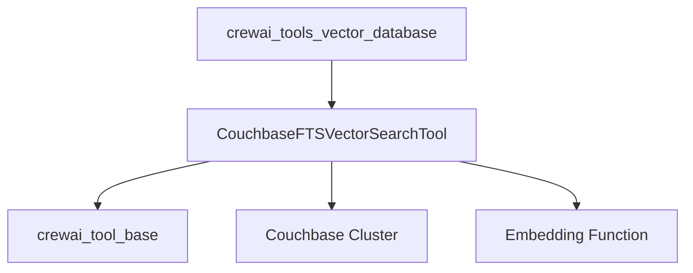

# `couchbase_vector_search`

The `couchbase_vector_search` module provides a specialized tool for performing vector similarity searches within Couchbase databases. It enables CrewAI agents to interact with Couchbase's Full-Text Search (FTS) capabilities, specifically leveraging vector search indexes to retrieve relevant documents based on an embedding query.

## Architecture and Core Components

The module's core functionality is encapsulated within the `CouchbaseFTSVectorSearchTool` class. This tool acts as an interface between CrewAI agents and a Couchbase cluster, allowing for efficient retrieval of information based on vector embeddings.

### `CouchbaseFTSVectorSearchTool`

`lib.crewai-tools.src.crewai_tools.tools.couchbase_tool.couchbase_tool.CouchbaseFTSVectorSearchTool`

This class is a specialized [BaseTool](crewai_tool_base.md) designed for vector search in Couchbase. It requires configuration details for connecting to a Couchbase cluster and specifying the target bucket, scope, collection, and FTS index.

**Key Features:**

*   **Couchbase Integration**: Manages connection and interaction with a Couchbase cluster, including validation of bucket, scope, collection, and index existence.
*   **Vector Search**: Executes vector similarity queries against a configured Couchbase FTS index.
*   **Query Embedding**: Utilizes an external `embedding_function` to convert natural language queries into vector embeddings before performing the search.
*   **Configurable Parameters**: Allows specification of `bucket_name`, `scope_name`, `collection_name`, `index_name`, `embedding_key`, `scoped_index`, and `limit` for fine-grained control over the search operation.

### Dependencies

*   **`crewai_tool_base`**: The `CouchbaseFTSVectorSearchTool` inherits from `BaseTool`, providing the fundamental structure and integration within the CrewAI tools ecosystem. For more details, refer to [crewai_tool_base.md](crewai_tool_base.md).
*   **Couchbase Python SDK**: Internally, this tool relies on the `couchbase` Python package to connect and interact with Couchbase clusters.
*   **Embedding Function**: Requires a user-provided callable `embedding_function` to convert query strings into vector embeddings. This function is external to the `couchbase_vector_search` module.

## Module Relationships

The `couchbase_vector_search` module is a sub-module of `crewai_tools_vector_database`, positioning it as one of several vector database integration tools available within CrewAI. It provides a specific implementation for Couchbase, complementing other vector database tools like [qdrant_vector_search.md](qdrant_vector_search.md) and [weaviate_vector_search.md](weaviate_vector_search.md).

<!-- DIAGRAM_JSON
{
    "direction": "TD",
    "nodes": [
        {"id": "couchbase_tool", "label": "CouchbaseFTSVectorSearchTool", "type": "component", "link": null},
        {"id": "couchbase_cluster", "label": "Couchbase Cluster", "type": "external", "link": null},
        {"id": "embedding_function", "label": "Embedding Function", "type": "component", "link": null},
        {"id": "crewai_tool_base", "label": "crewai_tool_base", "type": "external", "link": "crewai_tool_base.md"},
        {"id": "crewai_tools_vector_database", "label": "crewai_tools_vector_database", "type": "external", "link": "crewai_tools_vector_database.md"}
    ],
    "edges": [
        {"source": "couchbase_tool", "target": "crewai_tool_base"},
        {"source": "couchbase_tool", "target": "couchbase_cluster"},
        {"source": "couchbase_tool", "target": "embedding_function"},
        {"source": "crewai_tools_vector_database", "target": "couchbase_tool"}
    ],
    "groups": []
}
-->
