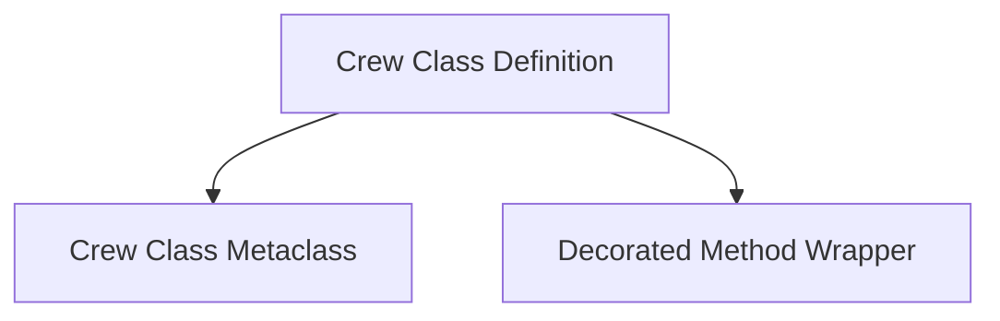

# Crew Class Definition Module

This module is responsible for the core mechanisms behind defining and managing 'Crew' classes within the system. It primarily deals with the metaclass that enables `CrewBase` to act as a decorator and a generic method wrapper to attach metadata to decorated methods.

## Architecture

The `crew_class_definition` module consists of two main sub-modules: `crew_class_metaclass` and `decorated_method_wrapper`. The `crew_class_metaclass` module defines how `CrewBase` objects are instantiated and behave as decorators, while the `decorated_method_wrapper` provides a flexible way to augment methods with additional metadata and functionality.

<!-- DIAGRAM_JSON
{
    "direction": "TD",
    "nodes": [
        {"id": "crew_class_metaclass", "label": "Crew Class Metaclass", "type": "module", "link": "crew_class_metaclass.md"},
        {"id": "decorated_method_wrapper", "label": "Decorated Method Wrapper", "type": "module", "link": "decorated_method_wrapper.md"}
    ],
    "edges": [
        {"source": "crew_class_metaclass", "target": "decorated_method_wrapper"}
    ],
    "groups": []
}
-->

## Sub-modules

*   ### [Crew Class Metaclass](crew_class_metaclass.md)
    Defines the metaclass responsible for transforming classes into CrewClass instances, enabling decorator-like behavior for CrewBase.

*   ### [Decorated Method Wrapper](decorated_method_wrapper.md)
    Provides a generic wrapper for methods, allowing the addition of metadata through decorators while maintaining the original method's signature and functionality.