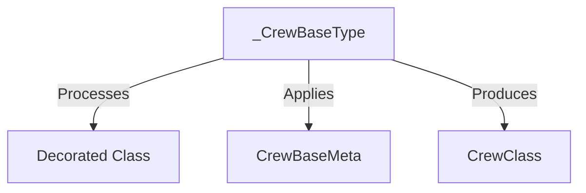

# crew_class_metaclass Module Documentation

## Introduction

This module, `crew_class_metaclass`, plays a crucial role in the `crewai` framework by defining the `_CrewBaseType` metaclass. This metaclass enables `CrewBase` to function as a decorator, facilitating the dynamic creation and modification of `Crew` classes.

## Core Functionality

The primary component of this module is `_CrewBaseType`.

### `_CrewBaseType`

`_CrewBaseType` is a metaclass designed to allow `CrewBase` to be used as a decorator. When a class is decorated with `CrewBase`, the `__call__` method of `_CrewBaseType` is invoked. This method intercepts the decorated class and transforms it by applying the `CrewBaseMeta` metaclass, effectively injecting `CrewBaseMeta`'s behaviors into the decorated class.

**Key steps in the `__call__` method:**
1.  **Extracts class metadata:** Retrieves the name, bases, and dictionary (`__dict__`) of the `decorated_cls`.
2.  **Cleans dictionary:** Removes internal Python attributes like `__dict__` and `__weakref__`, and any attributes defined in `__slots__`.
3.  **Applies `CrewBaseMeta`:** Sets `__metaclass__` to `CrewBaseMeta` within the new class's dictionary, and then creates a new type using `CrewBaseMeta` with the extracted and cleaned metadata.
4.  **Returns `CrewClass`:** The transformed class is cast to `CrewClass`, indicating it now possesses the characteristics and functionalities defined by `CrewBaseMeta`.

## Architecture and Component Relationships

This module's architecture centers around the `_CrewBaseType` metaclass, which acts as an intermediary to infuse specific behaviors into `Crew` classes.

<!-- DIAGRAM_JSON
{
    "direction": "TD",
    "nodes": [
        {"id": "_crew_base_type", "label": "_CrewBaseType", "type": "component", "link": null},
        {"id": "decorated_cls", "label": "Decorated Class", "type": "external", "link": null},
        {"id": "crew_base_meta", "label": "CrewBaseMeta", "type": "external", "link": "crew_class_definition.md"},
        {"id": "crew_class", "label": "CrewClass", "type": "external", "link": "crew_class_definition.md"}
    ],
    "edges": [
        {"source": "_crew_base_type", "target": "decorated_cls", "label": "Processes"},
        {"source": "_crew_base_type", "target": "crew_base_meta", "label": "Applies"},
        {"source": "_crew_base_type", "target": "crew_class", "label": "Produces"}
    ],
    "groups": []
}
-->

## Integration with the Overall System

The `crew_class_metaclass` module is a fundamental part of the `crewai_project_structure` module, specifically within the `project_core_mechanisms.crew_class_definition` sub-module. It works in conjunction with `CrewBase` (which implicitly uses this metaclass) to define the structure and behavior of `Crew` instances.

This mechanism allows developers to easily create robust `Crew` classes using a decorator pattern, leveraging the advanced metaprogramming capabilities provided by `_CrewBaseType` to inject core `Crew` functionalities. For further details on the components that form a `Crew` and how methods are wrapped, refer to the [crew_class_definition module](crew_class_definition.md) and [decorated_method_wrapper module](decorated_method_wrapper.md).