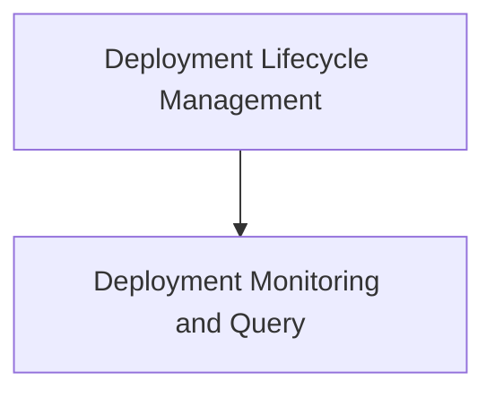

# Crew Deployment Management

The `crew_deployment_management` module provides a comprehensive set of command-line interface (CLI) tools for managing the lifecycle and monitoring of Crew AI deployments. It allows users to create, deploy, list, check the status, view logs, and remove Crew AI applications directly from the command line.

## Architecture Overview

This module integrates with the underlying deployment system to orchestrate Crew AI applications. It is composed of two primary sub-modules:

- [Deployment Lifecycle Management](deployment_lifecycle_management.md): Handles the core operations of creating, pushing, and removing deployments.
- [Deployment Monitoring and Query](deployment_monitoring_and_query.md): Focuses on providing visibility into active deployments, including listing, status checks, and log retrieval.

<!-- DIAGRAM_JSON
{
    "direction": "TD",
    "nodes": [
        {"id": "deployment_lifecycle_management", "label": "Deployment Lifecycle Management", "type": "module", "link": "deployment_lifecycle_management.md"},
        {"id": "deployment_monitoring_and_query", "label": "Deployment Monitoring and Query", "type": "module", "link": "deployment_monitoring_and_query.md"}
    ],
    "edges": [
        {"source": "deployment_lifecycle_management", "target": "deployment_monitoring_and_query"}
    ],
    "groups": []
}
-->

