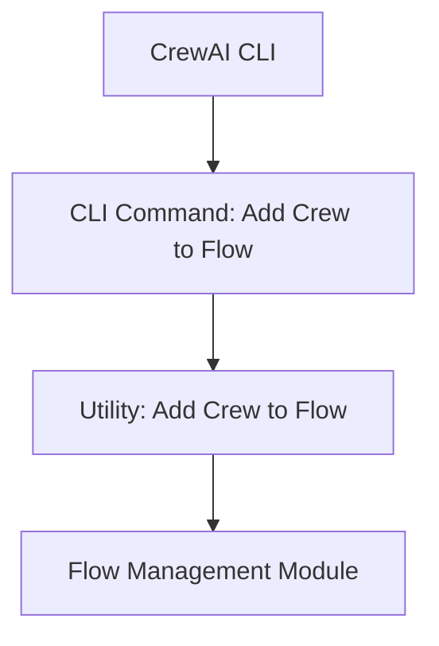

The `crew_integration` module is a vital component within the CrewAI Command Line Interface (CLI), specifically designed to facilitate the integration of new crews into existing operational flows. It acts as a bridge, allowing users to extend and modify their automated workflows directly from the command line.

### Purpose and Core Functionality

The primary purpose of the `crew_integration` module is to provide a CLI command to seamlessly add a crew to a pre-defined flow. This functionality is crucial for dynamic workflow management, enabling developers and maintainers to compose and expand complex multi-agent systems without manual intervention in configuration files.

Its core functionality revolves around the `flow_add_crew` command, which takes a crew name as an argument and orchestrates the process of incorporating that crew into the active flow. This involves interacting with the broader flow management system to ensure the crew is correctly registered and becomes an operational part of the workflow.

### Architecture and Component Relationships

The `crew_integration` module is a leaf module within the `crewai_cli.flow_orchestration` structure. It exposes a single, straightforward command-line interface.

**Internal Components:**
*   `flow_add_crew`: The main CLI entry point for adding a crew. It handles user input and initiates the integration process.
*   `add_crew_to_flow_function`: An internal utility function that encapsulates the logic for integrating a specified crew into a flow.

**External Dependencies:**
*   `crewai_cli`: The overarching CLI module that provides the command-line framework for `crew_integration`.
*   `crewai_flow_management`: This module is responsible for the actual management and modification of flows. The `add_crew_to_flow_function` relies heavily on this module to perform the core operation of adding a crew to a flow's definition or state.

### How the Module Fits into the Overall System

The `crew_integration` module is a specific utility within the CrewAI CLI that enhances the flexibility and manageability of automated agentic workflows. It serves as a user-facing interface for a critical backend operation: modifying the composition of a running or defined flow.

By enabling the addition of crews via a simple CLI command, it contributes to:
*   **Dynamic Workflow Composition**: Users can quickly modify flows without deep programmatic changes.
*   **Operational Efficiency**: Streamlines the process of scaling or adjusting agent teams within a flow.
*   **CLI-Driven Management**: Aligns with the overall CrewAI philosophy of providing robust command-line tools for system management.

It relies on the robust capabilities of the `crewai_flow_management` module for the actual flow manipulation, ensuring consistency and integrity of the workflow definitions.

<!-- DIAGRAM_JSON
{
    "direction": "TD",
    "nodes": [
        {"id": "flow_add_crew", "label": "CLI Command: Add Crew to Flow", "type": "component", "link": null},
        {"id": "add_crew_to_flow_util", "label": "Utility: Add Crew to Flow", "type": "component", "link": null},
        {"id": "crewai_flow_management", "label": "Flow Management Module", "type": "external", "link": "crewai_flow_management.md"},
        {"id": "crewai_cli", "label": "CrewAI CLI", "type": "external", "link": "crewai_cli.md"}
    ],
    "edges": [
        {"source": "crewai_cli", "target": "flow_add_crew"},
        {"source": "flow_add_crew", "target": "add_crew_to_flow_util"},
        {"source": "add_crew_to_flow_util", "target": "crewai_flow_management"}
    ],
    "groups": []
}
-->

The diagram illustrates how the `crew_integration` module, initiated by the [CrewAI CLI](crewai_cli.md), uses the `flow_add_crew` command. This command then calls an internal utility (`add_crew_to_flow_util`) which in turn interacts with the [Flow Management Module](crewai_flow_management.md) to perform the actual addition of a crew to a flow's definition or state.
