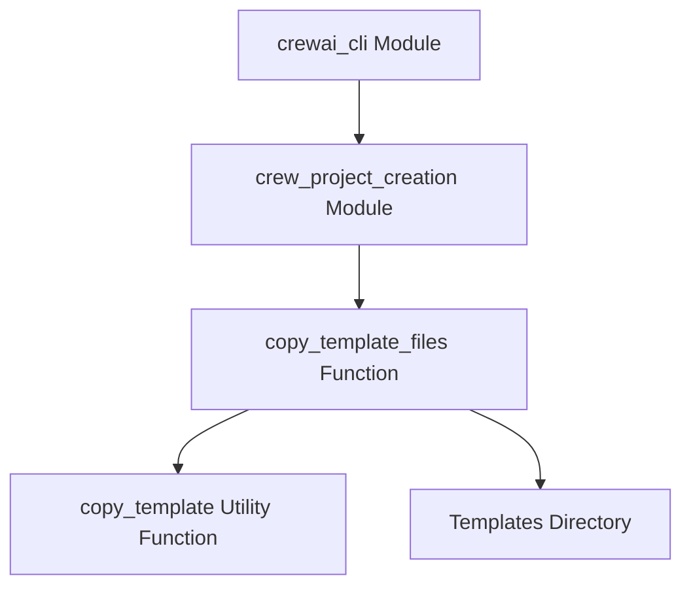

# crew_project_creation

The `crew_project_creation` module is a vital part of the CrewAI CLI, responsible for scaffolding new CrewAI projects and sub-projects from predefined templates. It provides the core functionality to quickly set up the necessary file structure and initial configuration, enabling developers to kickstart their CrewAI applications efficiently.

### Purpose and Core Functionality

The primary purpose of the `crew_project_creation` module is to automate the initial setup of CrewAI projects. This includes copying essential files and directories such as `.gitignore`, `pyproject.toml`, `README.md`, knowledge base placeholders, and core source files for agents, tasks, and configurations. It differentiates between creating a new standalone project and adding a new "crew" (sub-project) within an existing project structure, adjusting the file copying logic accordingly.

The module abstracts away the manual process of creating files and folders, ensuring consistency and adherence to best practices for CrewAI project organization.

### Architecture and Component Relationships

The `crew_project_creation` module primarily consists of the `copy_template_files` function, which orchestrates the file copying process. This function relies on an internal utility function, `copy_template` (not explicitly provided but inferred from the code), to perform the actual file content copying and placeholder replacement. It also interacts with the module's `templates` directory to access the predefined project blueprints.

<!-- DIAGRAM_JSON
{
    "direction": "TD",
    "nodes": [
        {"id": "copy_template_files", "label": "copy_template_files Function", "type": "component", "link": null},
        {"id": "copy_template_util", "label": "copy_template Utility Function", "type": "component", "link": null},
        {"id": "templates_directory", "label": "Templates Directory", "type": "component", "link": null},
        {"id": "crewai_cli", "label": "crewai_cli Module", "type": "external", "link": "crewai_cli.md"}
    ],
    "edges": [
        {"source": "copy_template_files", "target": "copy_template_util"},
        {"source": "copy_template_files", "target": "templates_directory"},
        {"source": "crewai_cli", "target": "copy_template_files"}
    ],
    "groups": []
}
-->

### How the Module Fits into the Overall System

The `crew_project_creation` module is a sub-module of the [crewai_cli](crewai_cli.md) and plays a crucial role in the developer experience of CrewAI. It is typically invoked when a user runs a command like `crewai new project` or `crewai add crew` via the command-line interface.

It integrates with the broader CrewAI ecosystem by establishing a standardized project structure that is expected by other modules, such as those responsible for project execution, deployment, and testing. By providing a consistent starting point, it ensures compatibility and reduces setup overhead for developers working with CrewAI. Its output—a well-formed project directory—senrves as the foundation upon which the CrewAI application is built and operated.