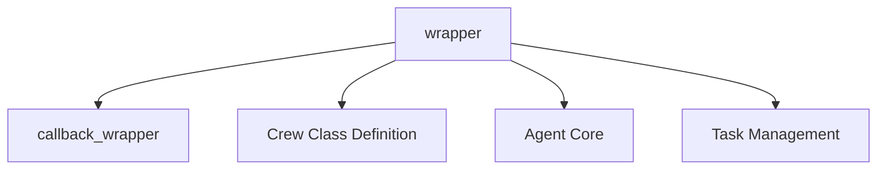

# crew_setup_wrapper

## Introduction
The `crew_setup_wrapper` module, part of the `crewai_project_structure.project_annotations` package, provides a crucial decorator for setting up and configuring a `Crew` instance before the execution of a decorated method. It automates the instantiation of `Agent` and `Task` objects, manages their relationships, and attaches lifecycle callbacks, ensuring a properly initialized `Crew` for subsequent operations.

## Purpose and Core Functionality
The primary purpose of the `wrapper` component in this module is to encapsulate the logic required to prepare a `Crew` instance. This involves:

1.  **Agent and Task Instantiation**: It iterates through predefined agent and task methods (stored in `self.__crew_metadata__`) and instantiates them. It intelligently handles agents, ensuring that each unique agent (identified by its role) is instantiated only once, even if multiple tasks reference it.
2.  **Crew Configuration**: The instantiated `Agent` and `Task` objects are then assigned to the `Crew` instance, establishing the core components of the crew.
3.  **Callback Management**: It binds `before_kickoff` and `after_kickoff` callback functions to the `Crew` instance. These callbacks allow for custom logic to be executed at key points in the crew's lifecycle. The `callback_wrapper` internal function ensures that these hooks are correctly bound to the `CrewInstance` context.
4.  **Method Decoration**: Acting as a decorator, `wrapper` ensures that any method it adorns will have a fully initialized `Crew` available before its own logic is executed, simplifying the development of crew-based applications.

## Architecture and Component Relationships

<!-- DIAGRAM_JSON
{
    "direction": "TD",
    "nodes": [
        {"id": "wrapper", "label": "wrapper", "type": "component", "link": null},
        {"id": "callback_wrapper", "label": "callback_wrapper", "type": "component", "link": null},
        {"id": "crew_class_definition", "label": "Crew Class Definition", "type": "external", "link": "crew_class_definition.md"},
        {"id": "crewai_agent_core", "label": "Agent Core", "type": "external", "link": "crewai_agent_core.md"},
        {"id": "crewai_task_management", "label": "Task Management", "type": "external", "link": "crewai_task_management.md"}
    ],
    "edges": [
        {"source": "wrapper", "target": "callback_wrapper"},
        {"source": "wrapper", "target": "crew_class_definition"},
        {"source": "wrapper", "target": "crewai_agent_core"},
        {"source": "wrapper", "target": "crewai_task_management"}
    ],
    "groups": []
}
-->

### Component Breakdown:

*   **`wrapper`**: The main function of this module. It orchestrates the setup of the `Crew` instance, including agent and task instantiation and callback attachment.
*   **`callback_wrapper`**: An internal helper function used by `wrapper` to correctly bind lifecycle hook callbacks (e.g., `before_kickoff`, `after_kickoff`) to the `CrewInstance`.

### External Dependencies:

*   **[Crew Class Definition](crew_class_definition.md)**: The `wrapper` directly interacts with the `Crew` class, which is defined in the `crewai_project_structure.project_core_mechanisms.crew_class_definition` module. It instantiates and configures `Crew` objects.
*   **[Agent Core](crewai_agent_core.md)**: The `wrapper` instantiates `Agent` objects. The fundamental definition and behavior of agents are managed within the `crewai_agent_core` module.
*   **[Task Management](crewai_task_management.md)**: Similarly, `Task` objects are instantiated by the `wrapper`. The `crewai_task_management` module provides the core definitions and functionalities related to tasks.

## How the Module Fits into the Overall System
The `crew_setup_wrapper` module is a vital part of the `crewai_project_structure.project_annotations` package, which is responsible for declarative definitions and annotations within CrewAI projects. It acts as an initializer, bridging the declarative definition of agents and tasks (likely defined within the class using annotations) with their runtime instantiation and configuration into a functional `Crew` object.

It ensures that when a method decorated by this wrapper is called, the `Crew` object passed to it is fully assembled with all its agents, tasks, and necessary callbacks, ready for execution. This significantly reduces boilerplate code and promotes a cleaner, more declarative way of defining and setting up CrewAI projects. Its role is foundational for the `Crew`'s operational readiness and the execution of its defined workflow.