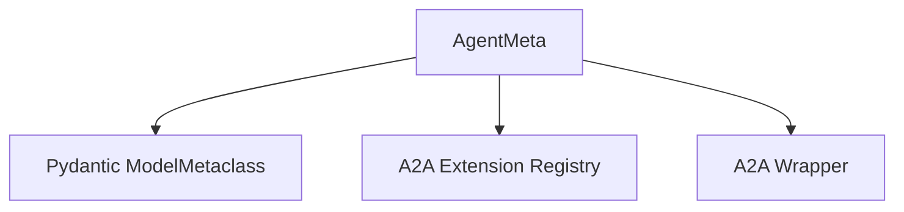

# Module: crewai_agent_core

## Introduction

The `crewai_agent_core` module provides the foundational metaclass, `AgentMeta`, for creating extensible agent instances within the CrewAI framework. Its primary role is to intercept agent initialization to dynamically apply extension logic, most notably for enabling agent-to-agent (A2A) communication capabilities. By using a metaclass, `crewai_agent_core` ensures that extensions are seamlessly integrated into the agent lifecycle without requiring manual boilerplate code in each agent definition.

## Architecture and Component Relationships

The `AgentMeta` component is central to this module. It extends Pydantic's `ModelMetaclass` to introduce custom logic during class creation. Specifically, it hooks into the `post_init_setup` method of agent classes. When an agent class defines an `a2a` attribute, `AgentMeta` orchestrates the creation of an extension registry and wraps the agent instance with the necessary A2A functionality.

<!-- DIAGRAM_JSON
{
    "direction": "TD",
    "nodes": [
        {"id": "agent_meta", "label": "AgentMeta", "type": "component", "link": null},
        {"id": "model_metaclass", "label": "Pydantic ModelMetaclass", "type": "external", "link": null},
        {"id": "a2a_registry", "label": "A2A Extension Registry", "type": "external", "link": "crewai_agent_to_agent_communication.md"},
        {"id": "a2a_wrapper", "label": "A2A Wrapper", "type": "external", "link": "crewai_agent_to_agent_communication.md"}
    ],
    "edges": [
        {"source": "agent_meta", "target": "model_metaclass"},
        {"source": "agent_meta", "target": "a2a_registry"},
        {"source": "agent_meta", "target": "a2a_wrapper"}
    ],
    "groups": []
}
-->

### Component: AgentMeta

`AgentMeta` is a Python metaclass that inherits from Pydantic's `ModelMetaclass`. It is responsible for:

*   **Extension Detection:** During the creation of an agent class, `AgentMeta` inspects the class namespace for specific extension fields, such as `a2a`.
*   **Method Wrapping:** If an `a2a` field is detected, it wraps the agent's `post_init_setup` method. This ensures that extension-specific logic is applied *after* the agent's initial setup is complete.
*   **A2A Integration:** The wrapped `post_init_setup` calls functions from the `crewai_agent_to_agent_communication` module:
    *   `create_extension_registry_from_config`: Initializes the extension registry based on the agent's A2A configuration.
    *   `wrap_agent_with_a2a_instance`: Integrates the A2A functionality into the agent instance using the created registry.

This mechanism allows agents to gain sophisticated capabilities like inter-agent communication without deeply coupling the core agent definition with specific extension implementations.

## How it Fits into the Overall System

The `crewai_agent_core` module, through `AgentMeta`, serves as a fundamental extension point in the CrewAI ecosystem. It enables a plug-and-play architecture for agent capabilities, with `crewai_agent_to_agent_communication` being a prime example of an extension seamlessly integrated via this metaclass. Any future extensions requiring post-initialization setup or configuration can leverage this metaclass pattern, promoting a clean and modular design across the CrewAI framework. It ensures that agents can be empowered with advanced features like A2A communication as part of their standard lifecycle, abstracting away the complexities of extension integration from the agent developer.