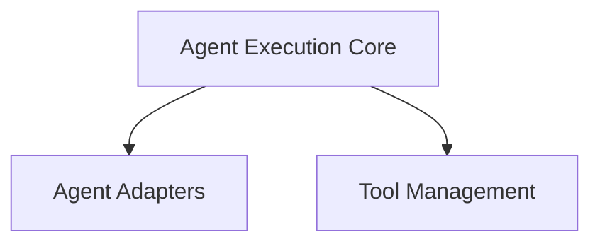

# CrewAI Agent Management

## Introduction

The `crewai_agent_management` module is responsible for orchestrating the behavior and execution of agents within the CrewAI framework. It provides the core mechanisms for adapting different agent technologies, managing task execution workflows, and handling tool interactions.

## Architecture Overview

This module is structured into several key sub-modules that work together to enable flexible and robust agent operations. The architecture is designed to allow integration with various underlying LLM agent frameworks while providing a consistent interface for managing agent tasks and tools.

<!-- DIAGRAM_JSON
{
    "direction": "TD",
    "nodes": [
        {"id": "agent_execution", "label": "Agent Execution Core", "type": "module", "link": "agent_execution.md"},
        {"id": "agent_adapters", "label": "Agent Adapters", "type": "module", "link": "agent_adapters.md"},
        {"id": "tool_management", "label": "Tool Management", "type": "module", "link": "tool_management.md"}
    ],
    "edges": [
        {"source": "agent_execution", "target": "agent_adapters"},
        {"source": "agent_execution", "target": "tool_management"}
    ],
    "groups": []
}
-->

## Sub-modules

### [Agent Adapters](agent_adapters.md)
Provides interfaces and implementations for integrating various agent frameworks with CrewAI, handling structured output and tool configuration.

### [Agent Execution Core](agent_execution.md)
Manages the core lifecycle of agent execution, including prompt handling, LLM interaction, tool invocation, and human feedback.

### [Tool Management](tool_management.md)
Handles the management and caching of tools used by agents, processing tool calls and their outputs.
