## `crewai_agent_to_agent_communication` Module Overview

The `crewai_agent_to_agent_communication` module, often referred to as `a2a`, is the foundational component within CrewAI for enabling secure, robust, and extensible communication between agents. It provides the necessary infrastructure for agents to delegate tasks, exchange information, manage state, and interact with external systems, supporting various authentication methods, update mechanisms, and UI extensions. This module is critical for building complex multi-agent systems where agents need to collaborate and coordinate effectively.

### Architecture Overview

The `crewai_agent_to_agent_communication` module is structured into several key sub-modules, each handling a specific aspect of agent-to-agent interaction. These include authentication, configuration management, UI extensions, update handling, agent card utilities, delegation utilities, task management, and overall wrapper functions for integrating A2A capabilities into agent workflows.

```mermaid
graph TD
    A[crewai_agent_to_agent_communication]
    B[a2a_auth_schemes]
    C[a2a_config]
    D[a2a_a2ui_extensions]
    E[a2a_update_handlers]
    F[a2a_agent_card_utils]
    G[a2a_delegation_utils]
    H[a2a_task_utils]
    I[a2a_wrapper]

    A --> B
    A --> C
    A --> D
    A --> E
    A --> F
    A --> G
    A --> H
    A --> I

    click B "a2a_auth_schemes.md" "View A2A Authentication Schemes Documentation"
    click C "a2a_config.md" "View A2A Config Documentation"
    click D "a2a_a2ui_extensions.md" "View A2A A2UI Extensions Documentation"
    click E "a2a_update_handlers.md" "View A2A Update Handlers Documentation"
    click F "a2a_agent_card_utils.md" "View A2A Agent Card Utilities Documentation"
    click G "a2a_delegation_utils.md" "View A2A Delegation Utilities Documentation"
    click H "a2a_task_utils.md" "View A2A Task Utilities Documentation"
    click I "a2a_wrapper.md" "View A2A Wrapper Documentation"
```

### References to Core Components Documentation

*   **[A2A Authentication Schemes](a2a_auth_schemes.md)**
    This module provides a comprehensive set of authentication schemes for both client-side and server-side interactions within the Agent-to-Agent (A2A) communication framework. It enables secure and flexible authentication across various protocols and standards, including API keys, Bearer tokens, HTTP Basic/Digest, and OAuth2.

*   **[A2A Config](a2a_config.md)**
    The `a2a_config` module is responsible for managing the configuration settings for Agent-to-Agent (A2A) communication within CrewAI. It defines how agents connect, authenticate, handle timeouts, and manage updates and extensions for seamless interaction between different agent instances.

*   **[A2A A2UI Extensions](a2a_a2ui_extensions.md)**
    The `a2a_a2ui_extensions` module provides crucial functionalities for integrating the A2UI (Agent to User Interface) protocol within the Agent-to-Agent (A2A) communication framework. It enables agents to generate declarative UI elements and interact with client-side UIs, facilitating richer and more interactive agent experiences.

*   **[A2A Update Handlers](a2a_update_handlers.md)**
    The `a2a_update_handlers` module is a crucial part of the Agent-to-Agent (A2A) communication system within CrewAI. It is responsible for managing how agents receive and process updates during delegation, ensuring seamless and reliable information exchange.

*   **[A2A Agent Card Utilities](a2a_agent_card_utils.md)**
    The `a2a_agent_card_utils` module provides essential utilities for managing AgentCards within the Agent-to-Agent (A2A) communication framework. This includes functionalities for generating agent cards from CrewAI agents and crews, as well as verifying their digital signatures to ensure secure and authentic interactions.

*   **[a2a_delegation_utils](a2a_delegation_utils.md)**
    The `a2a_delegation_utils` module, part of the larger `crewai_agent_to_agent_communication` system, is responsible for handling secure and structured delegation within the Agent-to-Agent (A2A) communication framework. Its primary function is to facilitate the injection of authentication metadata into gRPC calls, ensuring that delegated tasks and communications are properly authorized and authenticated.

*   **[A2A Task Utilities (`a2a_task_utils`)](a2a_task_utils.md)**
    This module, `a2a_task_utils`, is a core part of the broader Agent-to-Agent Communication (A2A) system within CrewAI. It provides essential utility functions for managing task execution and handling cancellations in an asynchronous, distributed agent environment.

*   **[`a2a_wrapper`](a2a_wrapper.md)**
    The `a2a_wrapper` module is a crucial component within the CrewAI framework, designed to facilitate seamless Agent-to-Agent (A2A) communication and delegation. It provides wrapper functions that augment standard agent task execution and kickoff processes with A2A capabilities, allowing agents to delegate tasks and coordinate actions effectively within a multi-agent system.