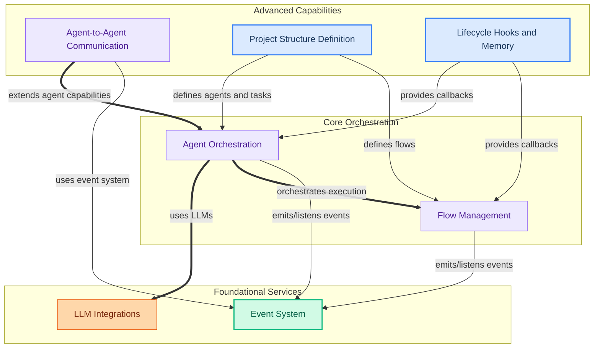

The `crewai_core` module serves as the foundational backbone of the CrewAI framework, enabling the orchestration of intelligent agents, managing complex execution flows, and facilitating robust inter-agent communication. It provides native integrations for various Large Language Models (LLMs), implements a comprehensive event system for traceability and state management, and offers structured project definition capabilities through annotations and lifecycle hooks. This core module ensures that agents can effectively collaborate, interact with external tools, and maintain state across intricate workflows.

### How `crewai_core` Components Work Together

The `crewai_core` module is composed of several key sub-modules that work in concert to provide the full functionality of the CrewAI framework.

### Core Components Documentation

*   **Agent Orchestration**: Manages agent lifecycles, adapters for various LLM frameworks, and structured output.
*   **Flow Management**: Defines the core `Flow` class for orchestrating complex, stateful execution flows, including human feedback, checkpointing, and state persistence.
*   **LLM Integrations**: Provides native integrations for various Large Language Models (LLMs) from providers like Anthropic, Azure, Bedrock, Gemini, OpenAI, and OpenAI-compatible services.
*   **Event System**: Offers the core event handling infrastructure, including a singleton event bus, event definitions, context management, and event recording for traceability and checkpointing.
*   **Agent-to-Agent Communication**: Provides the foundational framework for secure and extensible inter-agent communication, including authentication, configuration, and various update mechanisms.
*   **Project Structure Definition**: Offers decorators for defining and configuring components within a CrewAI project, such as tasks, agents, LLMs, tools, cache handlers, lifecycle hooks, and output formats.
*   **Lifecycle Hooks and Memory**: Provides decorators for registering LLM and tool call hooks, along with wrappers for class methods acting as hooks, and utilities for memory analysis.