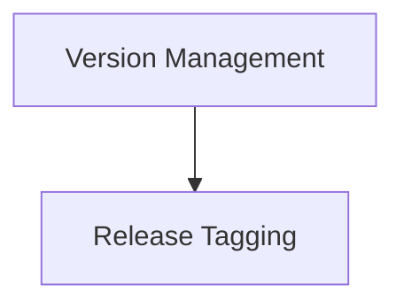

# `crewai_devtools_cli` Module Documentation

## Introduction

The `crewai_devtools_cli` module provides essential command-line interface (CLI) tools for managing the development lifecycle of CrewAI projects. It automates critical tasks such as version bumping across packages and creating release tags, streamlining the release process for developers.

## Architecture Overview

The `crewai_devtools_cli` module is designed to provide a cohesive interface for managing repository versions and releases. It is composed of key sub-modules that handle distinct aspects of the development workflow.

<!-- DIAGRAM_JSON
{
    "direction": "TD",
    "nodes": [
        {"id": "release_tagging", "label": "Release Tagging", "type": "module", "link": "release_tagging.md"},
        {"id": "version_management", "label": "Version Management", "type": "module", "link": "version_management.md"}
    ],
    "edges": [
        {"source": "version_management", "target": "release_tagging"}
    ],
    "groups": []
}
-->

## Sub-modules

### [Release Tagging](release_tagging.md)
This sub-module is responsible for creating and pushing version tags, generating release notes, and managing the GitHub release process after a version bump has been merged into the main branch.

### [Version Management](version_management.md)
This sub-module handles the automatic bumping of package versions across all `lib/` packages within the repository. It includes functionalities for git operations like branch creation, committing changes, and pushing to the remote repository.