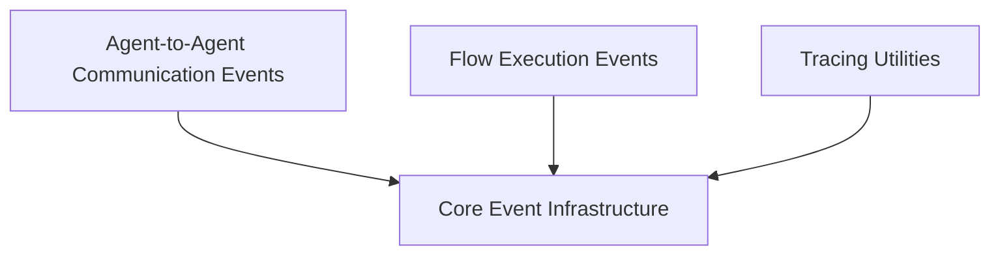

# CrewAI Event System

The `crewai_event_system` module provides a robust and flexible event-driven architecture for the CrewAI framework. It enables various components within the system to communicate and react to state changes and occurrences without tight coupling. This system is crucial for enabling features like agent-to-agent communication, flow management, and system-wide tracing.

## Architecture Overview

The `crewai_event_system` is built around a central event bus that manages event registration and emission. It categorizes events into different types, such as core events, Agent-to-Agent (A2A) communication events, and flow-specific events, allowing for modular and extensible event handling. The system also includes utilities for managing event contexts and tracing.

<!-- DIAGRAM_JSON
{
    "direction": "TD",
    "nodes": [
        {"id": "event_core", "label": "Core Event Infrastructure", "type": "module", "link": "event_core.md"},
        {"id": "a2a_events", "label": "Agent-to-Agent Communication Events", "type": "module", "link": "a2a_events.md"},
        {"id": "flow_events", "label": "Flow Execution Events", "type": "module", "link": "flow_events.md"},
        {"id": "tracing_utilities", "label": "Tracing Utilities", "type": "module", "link": "tracing_utilities.md"}
    ],
    "edges": [
        {"source": "a2a_events", "target": "event_core"},
        {"source": "flow_events", "target": "event_core"},
        {"source": "tracing_utilities", "target": "event_core"}
    ],
    "groups": []
}
-->

## Sub-modules and their Functionality

### [Core Event Infrastructure](event_core.md)
This sub-module lays the foundation for the entire event system. It includes the `BaseEvent` class, which all other events inherit from, and the `CrewAIEventsBus`, a singleton responsible for managing event registrations, emissions, and handler execution. It also provides `event_scope` for managing the context of events.

### [Agent-to-Agent Communication Events](a2a_events.md)
This sub-module defines a comprehensive set of event types specifically tailored for Agent-to-Agent (A2A) interactions. These events cover various aspects of A2A communication, including push notifications, agent card fetching, parallel delegation initiation and completion, and the entire lifecycle of A2A contexts (creation, expiration, idleness, completion, and pruning).

### [Flow Execution Events](flow_events.md)
Dedicated to the execution of flows within CrewAI, this sub-module contains event definitions like `FlowStartedEvent`. These events are crucial for tracking the lifecycle and state changes of autonomous workflows, enabling monitoring and reactive programming patterns.

### [Tracing Utilities](tracing_utilities.md)
This sub-module provides essential utilities for system tracing, particularly focusing on user confirmation for enabling tracing during the first execution of CrewAI. It helps in gathering diagnostic information and understanding the system's behavior during operation.