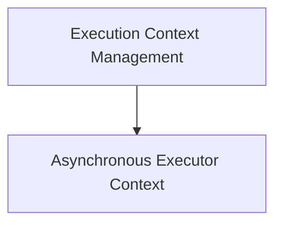

# CrewAI Execution Context Module

## Introduction

The `crewai_execution_context` module is responsible for managing and propagating execution context across various operations within the CrewAI framework. It ensures that crucial contextual information, such as task IDs, flow IDs, and event sequences, is consistently available and transferable, especially in asynchronous environments. This module is vital for maintaining state and traceability throughout complex multi-agent workflows.

## Architecture Overview

The module is structured to provide core functionalities for capturing, applying, and extending execution contexts. It integrates closely with the CrewAI core to enable seamless context flow.

<!-- DIAGRAM_JSON
{
    "direction": "TD",
    "nodes": [
        {"id": "execution_context_management", "label": "Execution Context Management", "type": "module", "link": "execution_context_management.md"},
        {"id": "async_executor_context", "label": "Asynchronous Executor Context", "type": "module", "link": "async_executor_context.md"}
    ],
    "edges": [
        {"source": "execution_context_management", "target": "async_executor_context"}
    ],
    "groups": []
}
-->

## Sub-modules and Functionality

### [Execution Context Management](execution_context_management.md)
This sub-module contains the core logic for capturing the current execution context (e.g., task ID, flow ID, event stack) into a standardized `ExecutionContext` object and applying a previously captured context back into the system's `ContextVars`. It ensures that the operational state is correctly saved and restored, which is crucial for maintaining continuity across different execution points, including asynchronous calls and distributed tasks.

### [Asynchronous Executor Context](async_executor_context.md)
This sub-module defines an extended interface, `AsyncExecutorContext`, specifically designed for executors that support asynchronous operations. It extends the base `ExecutorContext` with capabilities for asynchronous invocation, facilitating non-blocking execution of agent loops. This is particularly relevant for high-performance or distributed agent systems where efficient resource utilization is critical.