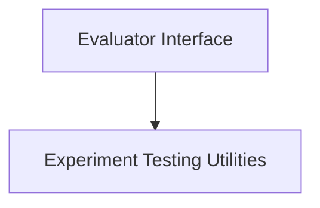

# CrewAI Experimental Evaluation Module

## Introduction

The `crewai_experimental_evaluation` module is designed to facilitate the experimental evaluation of CrewAI agents and tasks. It provides a foundational framework for defining custom evaluation metrics and utilities for executing and asserting the outcomes of experiments.

This module is crucial for quantitatively assessing the performance and reliability of AI agents in various scenarios, enabling developers to validate agent behavior and track improvements over time.

## Architecture Overview

The module is structured into two primary sub-modules:

-   **Evaluator Interface**: Defines the contract for custom evaluation metrics.
-   **Experiment Testing Utilities**: Provides the mechanisms for running and validating experiments.

These components work together to provide a robust system for evaluating the effectiveness of CrewAI applications.

<!-- DIAGRAM_JSON
{
    "direction": "TD",
    "nodes": [
        {"id": "evaluator_interface", "label": "Evaluator Interface", "type": "module", "link": "evaluator_interface.md"},
        {"id": "experiment_testing", "label": "Experiment Testing Utilities", "type": "module", "link": "experiment_testing.md"}
    ],
    "edges": [
        {"source": "evaluator_interface", "target": "experiment_testing"}
    ],
    "groups": []
}
-->

## Sub-modules

### [Evaluator Interface](evaluator_interface.md)

This sub-module provides the abstract base class `BaseEvaluator`, which serves as a blueprint for implementing custom evaluation logic. Developers can extend this class to define specific metrics and evaluation processes tailored to their agent's tasks and objectives.

### [Experiment Testing Utilities](experiment_testing.md)

This sub-module offers functions like `run_experiment` and `assert_experiment_successfully` to manage the execution of evaluation experiments and verify their results. It supports running experiments against datasets and comparing outcomes with established baselines to detect regressions or improvements.
