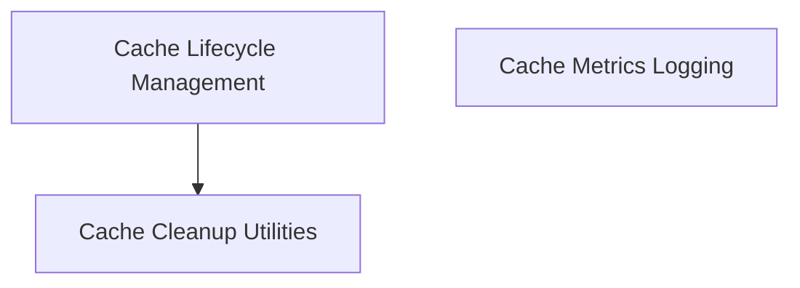

# crewai_files_cache Module Documentation

## Introduction and Purpose

The `crewai_files_cache` module is a critical component within the CrewAI ecosystem, primarily responsible for managing the caching of uploaded files. Its core purpose is to ensure efficient storage, retrieval, and lifecycle management of files, facilitating smooth operations for various CrewAI agents and tools. This includes robust mechanisms for cleaning up expired or provider-specific files, as well as comprehensive logging of file operations for monitoring and auditing. By centralizing cache management, it helps maintain data integrity, optimize resource utilization, and enhance the overall reliability of file-related processes.

## Architecture Overview

The `crewai_files_cache` module is designed with a clear separation of concerns, structured into several key sub-modules. This modular architecture allows for maintainable and scalable management of cached files and related operations. The main sub-modules are:

- **Cache Cleanup (`cache_cleanup.md`):** This sub-module contains the core logic for removing files from the cache and external storage providers. It supports both synchronous and asynchronous operations to handle various cleanup scenarios.
- **Cache Lifecycle Management (`cache_lifecycle.md`):** This sub-module focuses on automating cache cleanup processes, particularly those that occur during the application's lifecycle, such as on process exit.
- **Cache Metrics Logging (`cache_metrics.md`):** This sub-module is dedicated to logging file operations, providing structured data for monitoring, debugging, and performance analysis.

These sub-modules work in conjunction to provide a comprehensive file caching solution. For example, the `cache_lifecycle` module leverages the functionalities provided by `cache_cleanup` to perform its automated cleanup tasks, ensuring that resources are properly released.

<!-- DIAGRAM_JSON
{
    "direction": "TD",
    "nodes": [
        {"id": "cache_cleanup", "label": "Cache Cleanup Utilities", "type": "module", "link": "cache_cleanup.md"},
        {"id": "cache_lifecycle", "label": "Cache Lifecycle Management", "type": "module", "link": "cache_lifecycle.md"},
        {"id": "cache_metrics", "label": "Cache Metrics Logging", "type": "module", "link": "cache_metrics.md"}
    ],
    "edges": [
        {"source": "cache_lifecycle", "target": "cache_cleanup"}
    ],
    "groups": []
}
-->

## High-Level Functionality of Sub-modules

### [Cache Cleanup Utilities](cache_cleanup.md)

This sub-module provides a suite of functions designed to manage the removal of files from the `UploadCache`. It includes both synchronous and asynchronous methods for:
- Cleaning up files that have expired.
- Removing all files associated with a specific provider.
- Deleting individual files safely from both the cache and the underlying storage provider.

### [Cache Lifecycle Management](cache_lifecycle.md)

This sub-module is responsible for integrating cache cleanup into the application's lifecycle. Its primary function is to trigger the cleanup of uploaded files automatically when the application process exits, ensuring that temporary or unnecessary files are removed to prevent resource leaks and maintain a clean state.

### [Cache Metrics Logging](cache_metrics.md)

This sub-module offers a standardized way to log various file operations. It captures details such as the operation type, filename, provider, file size, duration, success status, and any error messages. This structured logging is invaluable for monitoring the health and performance of file caching operations, and for debugging issues.
