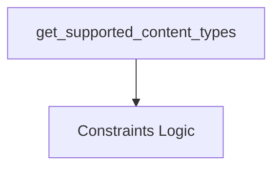

# crewai_files_processing

## Introduction

The `crewai_files_processing` module is responsible for managing and determining the supported content types for various providers and APIs within the CrewAI framework. It plays a crucial role in ensuring that files are processed correctly based on the capabilities of the integrated services.

## Architecture and Component Relationships

This module primarily focuses on defining and retrieving constraints related to file content types. Its core functionality revolves around identifying which MIME type prefixes (e.g., `image/`, `application/pdf`) are supported by a given provider or API. This information is essential for validating file uploads and ensuring compatibility across different tools and platforms.

<!-- DIAGRAM_JSON
{
    "direction": "TD",
    "nodes": [
        {"id": "get_supported_content_types", "label": "get_supported_content_types", "type": "component", "link": null},
        {"id": "constraints_logic", "label": "Constraints Logic", "type": "component", "link": null}
    ],
    "edges": [
        {"source": "get_supported_content_types", "target": "constraints_logic"}
    ],
    "groups": []
}
-->


### Core Components

#### `get_supported_content_types`

```python
def get_supported_content_types(provider: str, api: str | None = None) -> list[str]:
    """Get supported MIME type prefixes for a provider.

    Args:
        provider: Provider name string.
        api: Optional API variant (e.g., "responses" for OpenAI Responses API).

    Returns:
        List of supported MIME type prefixes (e.g., ["image/", "application/pdf"]).
    """
    lookup_key = provider
    if api == "responses" and "openai" in provider.lower():
        lookup_key = "openai_responses"

    constraints = get_constraints_for_provider(lookup_key)
    if not constraints:
        return []

    types: list[str] = []
    if constraints.image:
        types.append("image/")
    if constraints.pdf:
        types.append("application/pdf")
    if constraints.audio:
        types.append("audio/")
    if constraints.video:
        types.append("video/")
    if constraints.text:
        types.append("text/")
    return types
```

This function serves as the primary interface for querying the supported content types. It takes a `provider` name and an optional `api` variant as input. Based on these parameters, it constructs a `lookup_key` and then delegates to `get_constraints_for_provider` to fetch the relevant constraints. Finally, it translates these constraints into a list of MIME type prefixes.

`get_constraints_for_provider` (represented as "Constraints Logic" in the diagram) is an internal utility function within this module that is responsible for retrieving the specific content type constraints associated with a given provider or API lookup key. While its implementation is not detailed here, it is crucial for enabling `get_supported_content_types` to function correctly.

## How the Module Fits into the Overall System

The `crewai_files_processing` module is a foundational component for any CrewAI module or tool that handles file inputs or outputs. It ensures that the system can correctly identify and validate the types of files it can process, preventing errors and ensuring compatibility with various external services and LLM providers. For instance, an uploader module might consult `crewai_files_processing` to determine if a specific file type is allowed before initiating an upload, or an AI model integration might use it to understand what content it can effectively interpret. It works in conjunction with other `crewai_files` modules like [crewai_files_cache](crewai_files_cache.md), [crewai_files_core](crewai_files_core.md), and [crewai_files_uploaders](crewai_files_uploaders.md) to provide a robust file handling system.