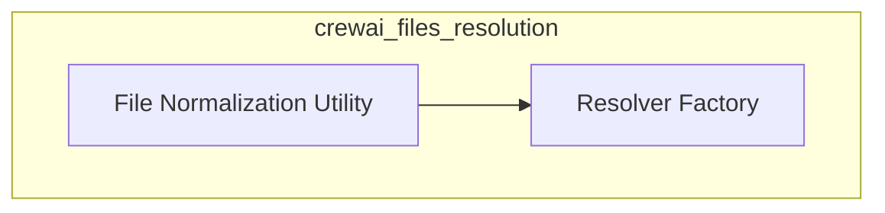

# crewai_files_resolution Module Documentation

## Introduction
This module is responsible for resolving and normalizing file inputs within the CrewAI framework. It provides functionalities to standardize diverse file sources and configure how files are handled, especially concerning upload mechanisms and caching.

## Architecture Overview
The `crewai_files_resolution` module is composed of two primary sub-modules:
- `resolver_factory`: Handles the creation and configuration of file resolvers.
- `file_normalization`: Manages the conversion of various file inputs into a unified format.

<!-- DIAGRAM_JSON
{
    "direction": "TD",
    "nodes": [
        {"id": "resolver_factory", "label": "Resolver Factory", "type": "module", "link": "resolver_factory.md"},
        {"id": "file_normalization", "label": "File Normalization Utility", "type": "module", "link": "file_normalization.md"}
    ],
    "edges": [
        {"source": "file_normalization", "target": "resolver_factory", "label": "Utilizes"}
    ],
    "groups": []
}
-->

## Sub-modules

### [Resolver Factory](resolver_factory.md)
This sub-module is responsible for creating and configuring `FileResolver` instances. It allows for setting preferences like preferring uploads over inline content, defining upload size thresholds, and enabling or disabling caching for uploaded files. It integrates with external constraints to determine default thresholds based on specified providers.

### [File Normalization Utility](file_normalization.md)
This sub-module provides a utility to convert a wide range of file source inputs (e.g., file paths, URLs, bytes, `BaseFile` objects) into a standardized dictionary of `FileInput` objects. This normalization ensures consistent handling of files throughout the CrewAI system, regardless of their initial input format.