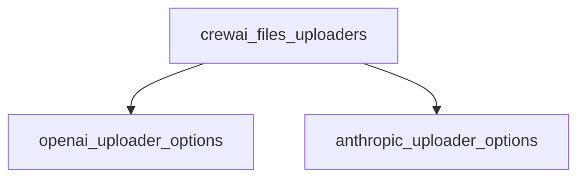

# crewai_files_uploaders Module Documentation

## Introduction

The `crewai_files_uploaders` module is responsible for providing interfaces and configurations for different file uploaders, specifically tailored for various AI model providers. It abstracts the specifics of uploading files to services like OpenAI and Anthropic, allowing for a standardized approach within the CrewAI framework.

## Architecture Overview

The `crewai_files_uploaders` module primarily consists of option classes that define the configurable parameters for integrating with different AI platform file upload APIs. These options are then used by the uploader factories to configure the file upload process.

<!-- DIAGRAM_JSON
{
    "direction": "TD",
    "nodes": [
        {"id": "openai_uploader_options", "label": "OpenAI Uploader Options", "type": "module", "link": "openai_uploader_options.md"},
        {"id": "anthropic_uploader_options", "label": "Anthropic Uploader Options", "type": "module", "link": "anthropic_uploader_options.md"}
    ],
    "edges": [
        {"source": "crewai_files_uploaders", "target": "openai_uploader_options"},
        {"source": "crewai_files_uploaders", "target": "anthropic_uploader_options"}
    ],
    "groups": []
}
-->

## Sub-modules

This module is composed of the following sub-modules, each handling specific aspects of file uploader configurations:

*   **[OpenAI Uploader Options](openai_uploader_options.md)**: Defines the configuration options for integrating with OpenAI's file upload services.
*   **[Anthropic Uploader Options](anthropic_uploader_options.md)**: Defines the configuration options for integrating with Anthropic's file upload services.
