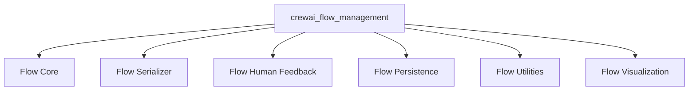

## `crewai_flow_management` Module Overview

The `crewai_flow_management` module is the central component within the CrewAI framework for defining, managing, executing, and visualizing complex, multi-step agentic workflows, referred to as "flows." It provides the foundational classes and mechanisms for flow creation, state management, execution control, persistence, and integration of human feedback, enabling robust and interactive AI-driven processes.

### Architecture

The `crewai_flow_management` module orchestrates several key sub-modules, each responsible for a specific aspect of flow functionality. This modular design ensures clear separation of concerns and allows for flexible extension and maintenance.

### Core Components Documentation

The `crewai_flow_management` module is composed of the following key sub-modules:

*   **[Flow Core](flow_core.md)**: The central component for defining, managing, and executing automated flows, providing foundational classes and mechanisms for flow creation, state management, and execution control.
*   **[Flow Serializer](flow_serializer.md)**: Responsible for introspecting and serializing the structural definition of a CrewAI `Flow` class into a comprehensive, JSON-serializable representation.
*   **[Flow Human Feedback](flow_human_feedback.md)**: Integrates human-in-the-loop (HITL) interactions into AI-driven flows, providing mechanisms for agents to request and incorporate human feedback.
*   **[Flow Persistence](flow_persistence.md)**: Manages the persistence of flow states, providing decorators to automatically save the state of a flow at various points during its execution.
*   **[Flow Utilities](flow_utils.md)**: A collection of utility functions and AST visitors crucial for analyzing, managing, and visualizing the structure and execution flow of CrewAI flows.
*   **[Flow Visualization](flow_visualization.md)**: Dedicated to generating structured, inspectable representations of methods within agentic flows, enabling visual understanding and dynamic introspection.