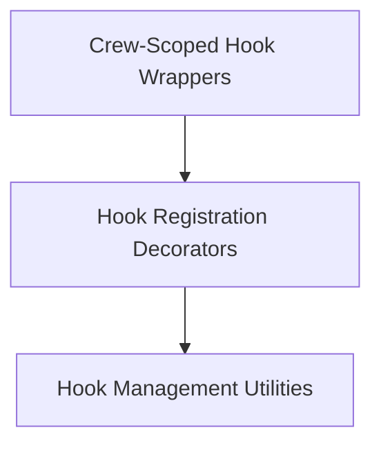

# CrewAI Hooks System Documentation

## Introduction and Purpose

The `crewai_hooks_system` module provides a robust and flexible mechanism for integrating custom logic into the lifecycle of LLM (Large Language Model) calls and tool executions within the CrewAI framework. It allows developers to register functions that execute before or after these critical operations, enabling a wide range of functionalities such as logging, input/output modification, conditional execution, and security checks. This system is crucial for extending CrewAI's capabilities and tailoring agent behavior to specific application needs.

## Architecture Overview

The `crewai_hooks_system` is structured into three main sub-modules:

1.  **Hook Registration Decorators (`hook_decorators.md`)**: Responsible for providing user-friendly decorators to mark and register functions as hooks.
2.  **Hook Management Utilities (`hook_management.md`)**: Contains core functions for managing and clearing the globally registered hooks.
3.  **Crew-Scoped Hook Wrappers (`hook_wrappers.md`)**: Offers wrapper classes that enable hooks to be defined as methods within `CrewBase` classes, allowing for instance-specific hook logic.

This modular design ensures clear separation of concerns, making the hook system easy to understand, extend, and maintain.

<!-- DIAGRAM_JSON
{
    "direction": "TD",
    "nodes": [
        {"id": "hook_decorators", "label": "Hook Registration Decorators", "type": "module", "link": "hook_decorators.md"},
        {"id": "hook_management", "label": "Hook Management Utilities", "type": "module", "link": "hook_management.md"},
        {"id": "hook_wrappers", "label": "Crew-Scoped Hook Wrappers", "type": "module", "link": "hook_wrappers.md"}
    ],
    "edges": [
        {"source": "hook_decorators", "target": "hook_management"},
        {"source": "hook_wrappers", "target": "hook_decorators"}
    ],
    "groups": []
}
-->

## Sub-modules

### [Hook Registration Decorators](hook_decorators.md)
This sub-module provides convenient decorators (`@before_llm_call`, `@after_llm_call`, `@before_tool_call`, `@after_tool_call`) that allow developers to easily register functions as hooks. These hooks can execute custom logic before or after LLM interactions and tool executions, with options to filter by specific agents or tools. This enables fine-grained control over the AI's operational flow.

### [Hook Management Utilities](hook_management.md)
This sub-module includes functionalities for managing the lifecycle of registered hooks. It provides utility functions, such as `clear_all_global_hooks`, to clear all active hooks. This is particularly useful for testing scenarios, resetting the system state, or ensuring a clean environment between different operational contexts.

### [Crew-Scoped Hook Wrappers](hook_wrappers.md)
This sub-module defines wrapper classes that are essential for enabling methods within `CrewBase` classes to function as hooks. These wrappers (e.g., `BeforeLLMCallHookMethod`) handle the binding of hook methods to `CrewBase` instances, allowing for instance-specific context and behavior. This design supports defining hooks directly within crew definitions, making them integral to the crew's operational logic.