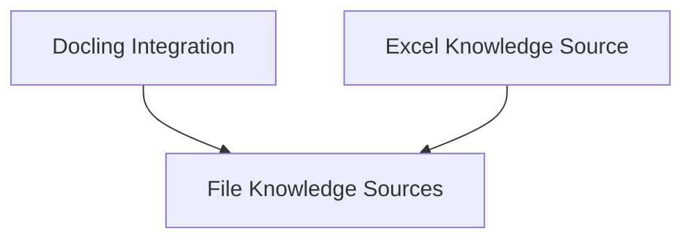

# CrewAI Knowledge Sources Module

The `crewai_knowledge_sources` module is responsible for defining and managing various types of knowledge sources within the CrewAI framework. It provides the foundational classes and specific implementations for integrating external data, primarily from files, into the system for agents to utilize.

## Architecture Overview

This module's architecture is centered around a base class for file-based knowledge sources, with specialized implementations for handling different file formats and data structures. It ensures flexible and robust ingestion of information from diverse origins.

<!-- DIAGRAM_JSON
{
    "direction": "TD",
    "nodes": [
        {"id": "file_knowledge_sources", "label": "File Knowledge Sources", "type": "module", "link": "file_knowledge_sources.md"},
        {"id": "docling_integration", "label": "Docling Integration", "type": "module", "link": "docling_integration.md"},
        {"id": "excel_knowledge_source", "label": "Excel Knowledge Source", "type": "module", "link": "excel_knowledge_source.md"}
    ],
    "edges": [
        {"source": "docling_integration", "target": "file_knowledge_sources"},
        {"source": "excel_knowledge_source", "target": "file_knowledge_sources"}
    ],
    "groups": []
}
-->

## Sub-modules

### [File Knowledge Sources](file_knowledge_sources.md)
Provides a foundational abstraction for knowledge sources that process and manage content from various file types.

### [Docling Integration](docling_integration.md)
Handles the conversion and processing of diverse document formats (PDF, DOCX, TXT, XLSX, Images, HTML) into structured knowledge using the docling package.

### [Excel Knowledge Source](excel_knowledge_source.md)
Specializes in extracting and processing data from Excel files, converting sheet content into a queryable format for knowledge retrieval.