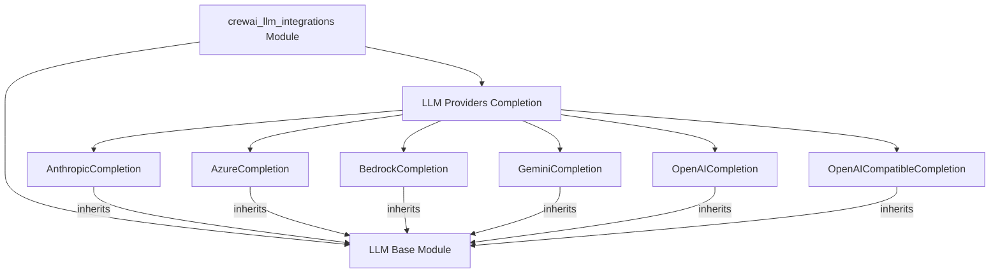

The `crewai_llm_integrations` module serves as a central hub for integrating various Large Language Model (LLM) providers into the CrewAI framework, specifically for handling chat completion functionalities. It offers native implementations for popular LLM services, ensuring seamless interaction, consistent API calls, and standardized output processing across different models. This module abstracts away the complexities of individual LLM APIs, allowing CrewAI agents to leverage diverse generative AI capabilities with a unified interface.

### Architecture of the Module

### References to Core Components Documentation

*   **LLM Base Module**: The foundational abstract class that all LLM completion providers inherit from, defining the common interface and core functionalities.
    *   [llm_base.md](llm_base.md)
*   **LLM Providers Completion**: The module containing native implementations for various LLM services.
    *   [llm_providers_completion.md](llm_providers_completion.md)
    *   **AnthropicCompletion**: Provides native integration with Anthropic's LLM completion services.
        *   [anthropic_completion.md](anthropic_completion.md)
    *   **AzureCompletion**: Offers robust integration with Azure AI Inference chat completion services.
        *   [azure_completion.md](azure_completion.md)
    *   **BedrockCompletion**: Implements native support for AWS Bedrock's Converse API for LLM completions.
        *   [bedrock_completion.md](bedrock_completion.md)
    *   **GeminiCompletion**: Integrates with Google's Gemini large language models, supporting function calling and streaming.
        *   [gemini_completion.md](gemini_completion.md)
    *   **OpenAICompletion**: Provides flexible integration with OpenAI's Chat Completions and Responses APIs.
        *   [openai_completion.md](openai_completion.md)
    *   **OpenAICompatibleCompletion**: A generic implementation for LLMs that adhere to the OpenAI API standard.
        *   [openai_compatible_completion.md](openai_compatible_completion.md)