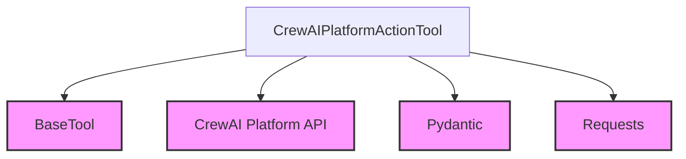

# crewai_platform_action_tool

The `crewai_platform_action_tool` module provides a specialized tool, `CrewAIPlatformActionTool`, designed to facilitate interaction with the CrewAI Platform's defined actions. This allows agents to execute specific functionalities exposed by the platform programmatically.

## Architecture and Core Functionality

The `CrewAIPlatformActionTool` is a core component within the `crewai_tools_platform_automation` module, inheriting from the [BaseTool](crewai_tool_base.md) class. Its primary responsibility is to dynamically configure itself based on an action's schema and then execute that action against the CrewAI Platform's API.

### Component: `CrewAIPlatformActionTool`

This class encapsulates the logic for interacting with CrewAI Platform actions.

*   **Initialization (`__init__`)**:
    *   Takes `description`, `action_name`, and `action_schema` as input.
    *   Dynamically generates an `args_schema` for the tool using `pydantic.create_model_from_schema` or `pydantic.create_model` based on the provided `action_schema`. This ensures that the tool's arguments are validated according to the platform's action definition.
    *   Normalizes the `action_name` to be used as the tool's `name` (lowercase, spaces replaced with underscores).
*   **Execution (`_run`)**:
    *   Prepares a payload by filtering out `None` values from the input arguments.
    *   Constructs the API endpoint URL for action execution using `get_platform_api_base_url()` and the `action_name`.
    *   Retrieves an authentication token using `get_platform_integration_token()`.
    *   Sends an HTTP POST request to the CrewAI Platform API with the prepared payload and authentication headers.
    *   Handles the API response, returning a JSON string of the data on success or an error message if the request fails.

### Dependencies

The `crewai_platform_action_tool` module relies on the following:

*   **`BaseTool`**: Inherits from this base class for fundamental tool functionalities.
*   **`requests`**: Used for making HTTP requests to the CrewAI Platform API.
*   **`pydantic`**: Utilized for dynamic schema validation and argument model generation.
*   **CrewAI Platform Configuration**: Depends on utility functions like `get_platform_api_base_url()` and `get_platform_integration_token()` (likely found within the `crewai_tools_platform_automation` module or a related configuration module) to obtain necessary API endpoints and authentication credentials.

<!-- DIAGRAM_JSON
{
    "direction": "TD",
    "nodes": [
        {"id": "CrewAIPlatformActionTool", "label": "CrewAIPlatformActionTool", "type": "component", "link": null},
        {"id": "BaseTool", "label": "BaseTool", "type": "external", "link": "crewai_tool_base.md"},
        {"id": "CrewAIPlatformAPI", "label": "CrewAI Platform API", "type": "external", "link": null},
        {"id": "Pydantic", "label": "Pydantic", "type": "external", "link": null},
        {"id": "Requests", "label": "Requests", "type": "external", "link": null}
    ],
    "edges": [
        {"source": "CrewAIPlatformActionTool", "target": "BaseTool"},
        {"source": "CrewAIPlatformActionTool", "target": "CrewAIPlatformAPI"},
        {"source": "CrewAIPlatformActionTool", "target": "Pydantic"},
        {"source": "CrewAIPlatformActionTool", "target": "Requests"}
    ],
    "groups": []
}
-->
