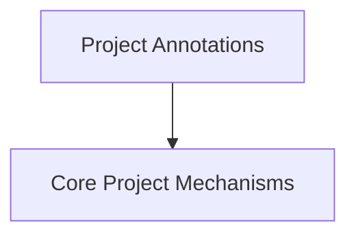

# crewai_project_structure

## Introduction and Purpose

The `crewai_project_structure` module is central to defining the architectural foundation and core operational mechanisms of CrewAI projects. It provides the essential building blocks, primarily through a robust system of annotations and core helper classes, that allow developers to structure their multi-agent systems effectively. This module ensures consistency and simplifies the definition of agents, tasks, tools, and LLMs, facilitating seamless integration and execution within the CrewAI framework.

## Architecture Overview

The `crewai_project_structure` module is logically divided into two main sub-modules: `project_annotations` and `project_core_mechanisms`.

-   **`project_annotations`**: This sub-module is responsible for defining the various decorators that mark methods and classes within a CrewAI project. These annotations (like `@task`, `@agent`, `@tool`) provide metadata that the CrewAI framework uses to understand and orchestrate the components of a crew.
-   **`project_core_mechanisms`**: This sub-module provides the underlying infrastructure and utility classes that enable the annotations and ensure the smooth functioning of a CrewAI project. It includes the metaclass for `CrewBase`, generic method wrappers, and caching utilities.

Together, these sub-modules work in tandem: annotations provide the declarative interface for defining crew components, while core mechanisms provide the imperative logic and structures to interpret and execute them.

<!-- DIAGRAM_JSON
{
    "direction": "TD",
    "nodes": [
        {"id": "project_annotations", "label": "Project Annotations", "type": "module", "link": "project_annotations.md"},
        {"id": "project_core_mechanisms", "label": "Core Project Mechanisms", "type": "module", "link": "project_core_mechanisms.md"}
    ],
    "edges": [
        {"source": "project_annotations", "target": "project_core_mechanisms"}
    ],
    "groups": []
}
-->

## Sub-modules

Here's a brief overview of the sub-modules within `crewai_project_structure`:

### [Project Annotations](project_annotations.md)
This sub-module defines decorators used to mark methods and classes as tasks, agents, LLMs, tools, cache handlers, and output formats within a CrewAI project. It also includes the core wrapper logic for setting up a crew based on these annotations.

### [Core Project Mechanisms](project_core_mechanisms.md)
This sub-module handles the foundational mechanics of CrewAI projects, including the CrewBase metaclass for dynamic class transformation, generic method wrapping for metadata preservation, and asynchronous caching utilities.
