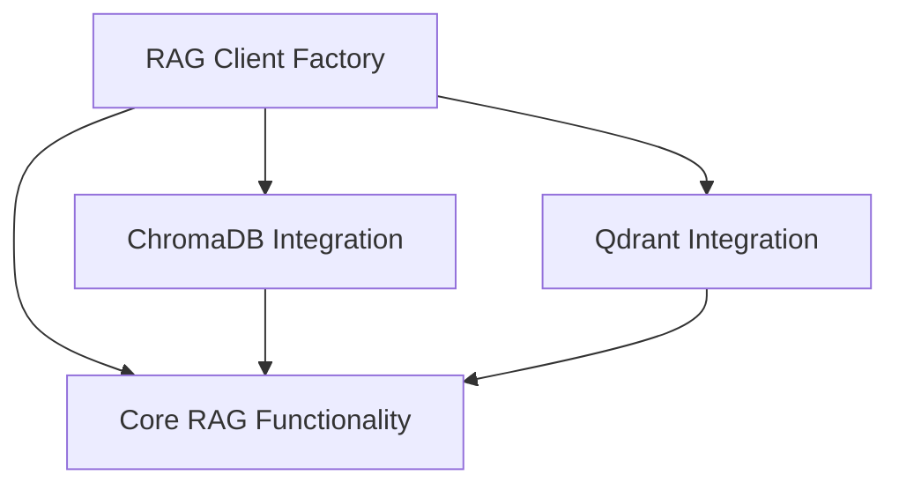

# CrewAI RAG System Documentation

## Introduction

The `crewai_rag_system` module provides the core functionality for Retrieval Augmented Generation (RAG) within the CrewAI framework. It enables agents to interact with various vector databases to store, retrieve, and manage knowledge, enhancing their ability to generate informed and contextually relevant responses.

This module abstracts the complexities of different vector database implementations, offering a unified interface for integrating RAG capabilities into autonomous agents. It supports multiple providers like ChromaDB and Qdrant, allowing for flexible configuration and scalability.

## Architecture Overview

The `crewai_rag_system` is designed with a modular architecture, separating core RAG concepts from specific database integrations and client management. This promotes extensibility and maintainability, allowing for easy addition of new vector database providers or modification of existing ones without impacting the entire system.

<!-- DIAGRAM_JSON
{
    "direction": "TD",
    "nodes": [
        {"id": "rag_core", "label": "Core RAG Functionality", "type": "module", "link": "rag_core.md"},
        {"id": "rag_factory", "label": "RAG Client Factory", "type": "module", "link": "rag_factory.md"},
        {"id": "chromadb_integration", "label": "ChromaDB Integration", "type": "module", "link": "chromadb_integration.md"},
        {"id": "qdrant_integration", "label": "Qdrant Integration", "type": "module", "link": "qdrant_integration.md"}
    ],
    "edges": [
        {"source": "rag_factory", "target": "chromadb_integration"},
        {"source": "rag_factory", "target": "qdrant_integration"},
        {"source": "rag_factory", "target": "rag_core"},
        {"source": "chromadb_integration", "target": "rag_core"},
        {"source": "qdrant_integration", "target": "rag_core"}
    ],
    "groups": []
}
-->

## Sub-modules

This module is composed of the following key sub-modules, each responsible for a specific aspect of the RAG system:

*   **[Core RAG Functionality](rag_core.md)**: Defines the foundational structures, base clients, and embedding function protocols for the Retrieval Augmented Generation (RAG) system.

*   **[RAG Client Factory](rag_factory.md)**: Provides a centralized factory for creating RAG clients, dynamically selecting the appropriate client implementation based on the configured provider.

*   **[ChromaDB Integration](chromadb_integration.md)**: Handles the configuration and client creation for ChromaDB, a popular open-source vector database, within the RAG system.

*   **[Qdrant Integration](qdrant_integration.md)**: Manages the configuration, type definitions, and embedding function wrappers for Qdrant, a high-performance vector search engine, used in the RAG system.
