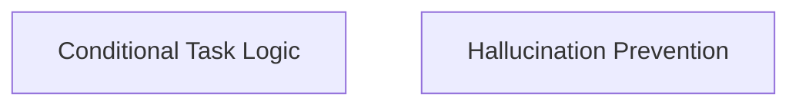

# CrewAI Task Management Module

## Introduction
The `crewai_task_management` module is responsible for defining and managing various types of tasks within the CrewAI framework. It provides functionalities for tasks with conditional execution and mechanisms for preventing AI model hallucinations in task outputs.

## Architecture Overview
This module is composed of two primary sub-modules:
- **[Conditional Task Logic](conditional_task_logic.md)**: Handles the dynamic execution of tasks based on specified conditions.
- **[Hallucination Prevention](hallucination_prevention.md)**: Offers a placeholder for a guardrail system designed to ensure the factual accuracy of AI-generated outputs.

These sub-modules work together to enable flexible and reliable task orchestration within the CrewAI ecosystem.

<!-- DIAGRAM_JSON
{
    "direction": "TD",
    "nodes": [
        {"id": "conditional_task_logic", "label": "Conditional Task Logic", "type": "module", "link": "conditional_task_logic.md"},
        {"id": "hallucination_prevention", "label": "Hallucination Prevention", "type": "module", "link": "hallucination_prevention.md"}
    ],
    "edges": [],
    "groups": []
}
-->

