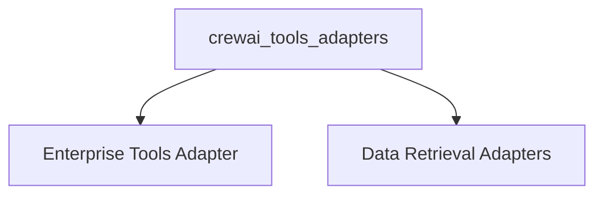

# crewai_tools_adapters

The `crewai_tools_adapters` module serves as a crucial integration layer, enabling CrewAI to interact with various external systems and data sources through a standardized adapter pattern. It abstracts the complexities of different external APIs and data structures, allowing agents to seamlessly utilize a wide range of tools, from enterprise-specific actions to advanced RAG capabilities and vector database queries.

## Architecture Overview

This module is designed with a clear separation of concerns, where each adapter specializes in integrating a particular type of external functionality. The core idea is to provide a unified interface for CrewAI agents, regardless of the underlying complexity of the external tool or data source.

<!-- DIAGRAM_JSON
{
    "direction": "TD",
    "nodes": [
        {"id": "enterprise_tools_adapter", "label": "Enterprise Tools Adapter", "type": "module", "link": "enterprise_tools_adapter.md"},
        {"id": "data_retrieval_adapters", "label": "Data Retrieval Adapters", "type": "module", "link": "data_retrieval_adapters.md"}
    ],
    "edges": [
        {"source": "crewai_tools_adapters", "target": "enterprise_tools_adapter"},
        {"source": "crewai_tools_adapters", "target": "data_retrieval_adapters"}
    ],
    "groups": []
}
-->

## Sub-modules

### [Enterprise Tools Adapter](enterprise_tools_adapter.md)
This sub-module focuses on integrating enterprise action kits. It dynamically fetches available actions from an enterprise API and converts them into callable `BaseTool` instances, allowing CrewAI agents to perform specialized enterprise-specific operations.

### [Data Retrieval Adapters](data_retrieval_adapters.md)
This sub-module provides adapters for managing and querying data. It includes an adapter for LanceDB, a persistent vector database, and a generic RAG (Retrieval Augmented Generation) adapter, enabling CrewAI agents to retrieve relevant information efficiently from various knowledge bases.