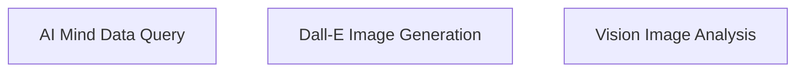

# crewai_tools_ai_model_tools Module Documentation

## Introduction and Purpose

The `crewai_tools_ai_model_tools` module provides a suite of tools that leverage advanced AI models for various tasks, including natural language data querying, image generation, and image analysis. These tools are designed to integrate seamlessly into CrewAI workflows, enabling agents to interact with and utilize powerful AI capabilities.

## Architecture Overview

The `crewai_tools_ai_model_tools` module is structured around specialized tools, each encapsulating a specific AI model's functionality. This modular design allows for independent development, maintenance, and easy integration of new AI capabilities. The module currently comprises three main sub-modules: AI Mind for data querying, Dall-E for image generation, and Vision for image analysis.

<!-- DIAGRAM_JSON
{
    "direction": "TD",
    "nodes": [
        {"id": "ai_mind_tool_module", "label": "AI Mind Data Query", "type": "module", "link": "ai_mind_tool_module.md"},
        {"id": "dalle_tool_module", "label": "Dall-E Image Generation", "type": "module", "link": "dalle_tool_module.md"},
        {"id": "vision_tool_module", "label": "Vision Image Analysis", "type": "module", "link": "vision_tool_module.md"}
    ],
    "edges": [],
    "groups": []
}
-->

## Sub-modules

### [AI Mind Data Query](ai_mind_tool_module.md)
This sub-module provides the `AIMindTool`, which allows agents to query various data sources (e.g., PostgreSQL, MySQL, Snowflake) using natural language questions through AI-Minds. It simplifies data retrieval and analysis from complex databases.

### [Dall-E Image Generation](dalle_tool_module.md)
The `dalle_tool_module` includes the `DallETool`, a powerful instrument for generating images from textual descriptions. Agents can leverage this tool to create visual content programmatically using OpenAI's Dall-E model.

### [Vision Image Analysis](vision_tool_module.md)
Contained within the `vision_tool_module` is the `VisionTool`, designed for analyzing and describing the content of images. It utilizes OpenAI's Vision API to provide textual descriptions of visual input, enhancing agents' ability to understand and interpret images.
